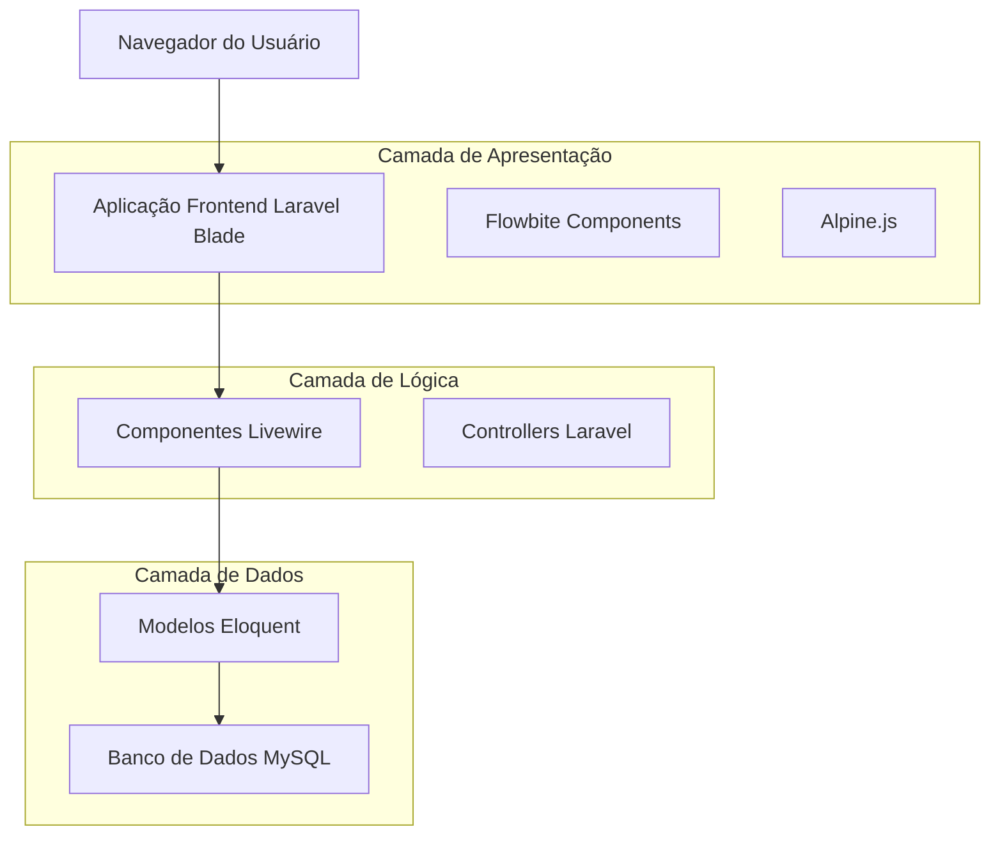
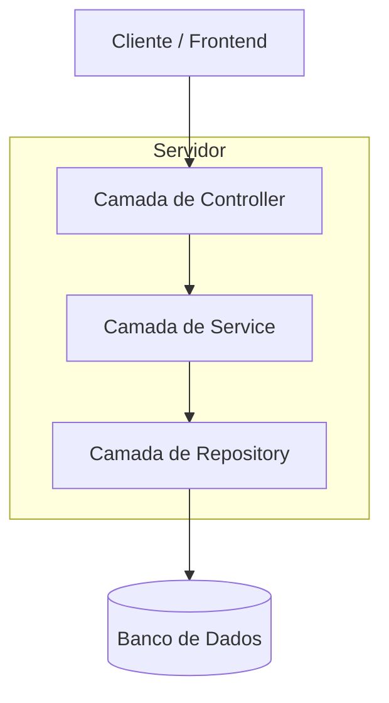
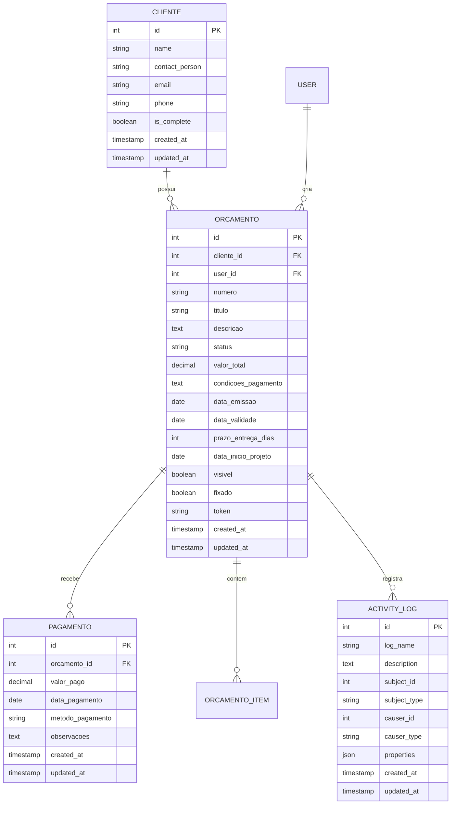

# Arquitetura Técnica - Página 360° do Cliente

## 1. Design da Arquitetura



## 2. Descrição das Tecnologias

* Frontend: Laravel Blade + Livewire 3 + Alpine.js + Tailwind CSS + Flowbite

* Backend: Laravel 10 + Eloquent ORM

* Banco de Dados: MySQL (existente)

* Componentes UI: Flowbite Tabs, Cards, Badges, DataTables

## 3. Definições de Rotas

| Rota                               | Propósito                                  |
| ---------------------------------- | ------------------------------------------ |
| /clientes/{cliente}                | Página 360° do cliente com sistema de abas |
| /clientes/{cliente}/orcamento/novo | Criar novo orçamento para o cliente        |
| /clientes/{cliente}/extrato.pdf    | Gerar PDF do extrato (existente)           |
| /clientes/{cliente}/export.csv     | Exportar dados do cliente em CSV           |

## 4. Definições de API

### 4.1 APIs Principais

**Dados do Cliente 360°**

```
GET /api/clientes/{id}/dashboard
```

Response:

| Nome do Parâmetro | Tipo   | Descrição                                                                               |
| ----------------- | ------ | --------------------------------------------------------------------------------------- |
| cliente           | object | Dados básicos do cliente                                                                |
| kpis              | object | Métricas calculadas (orçamentos\_enviados, taxa\_aprovacao, receita\_total, a\_receber) |
| timeline          | array  | Eventos cronológicos unificados                                                         |
| orcamentos        | array  | Lista de orçamentos com status e valores                                                |
| pagamentos        | array  | Histórico de pagamentos agrupados                                                       |

Exemplo:

```json
{
  "cliente": {
    "id": 1,
    "name": "Empresa XYZ",
    "tags": ["ativo", "recorrente"]
  },
  "kpis": {
    "orcamentos_enviados": 12,
    "taxa_aprovacao": 58.33,
    "receita_total": 25000.00,
    "a_receber": 8500.00
  }
}
```

## 5. Arquitetura do Servidor



## 6. Modelo de Dados

### 6.1 Definição do Modelo de Dados



### 6.2 Linguagem de Definição de Dados

**Tabela de Timeline de Eventos (nova)**

```sql
-- Criar tabela para eventos da timeline
CREATE TABLE cliente_timeline_events (
    id BIGINT UNSIGNED AUTO_INCREMENT PRIMARY KEY,
    cliente_id BIGINT UNSIGNED NOT NULL,
    event_type ENUM('orcamento_criado', 'orcamento_visualizado', 'orcamento_aprovado', 'orcamento_rejeitado', 'pagamento_recebido', 'projeto_publicado', 'prazo_alerta') NOT NULL,
    event_title VARCHAR(255) NOT NULL,
    event_description TEXT,
    related_id BIGINT UNSIGNED NULL, -- ID do orçamento/pagamento relacionado
    related_type VARCHAR(50) NULL, -- 'orcamento', 'pagamento', etc.
    event_data JSON NULL, -- dados adicionais do evento
    created_at TIMESTAMP DEFAULT CURRENT_TIMESTAMP,
    updated_at TIMESTAMP DEFAULT CURRENT_TIMESTAMP ON UPDATE CURRENT_TIMESTAMP,
    
    FOREIGN KEY (cliente_id) REFERENCES clientes(id) ON DELETE CASCADE,
    INDEX idx_cliente_timeline_cliente_id (cliente_id),
    INDEX idx_cliente_timeline_created_at (created_at DESC),
    INDEX idx_cliente_timeline_event_type (event_type)
);

-- Criar índices para performance
CREATE INDEX idx_orcamentos_cliente_status ON orcamentos(cliente_id, status);
CREATE INDEX idx_pagamentos_orcamento_data ON pagamentos(orcamento_id, data_pagamento DESC);
CREATE INDEX idx_activity_log_subject ON activity_log(subject_type, subject_id, created_at DESC);

-- Dados iniciais para tipos de eventos
INSERT INTO cliente_timeline_events (cliente_id, event_type, event_title, event_description, related_id, related_type)
SELECT 
    o.cliente_id,
    'orcamento_criado',
    CONCAT('Orçamento #', o.numero, ' criado'),
    CONCAT('Orçamento "', o.titulo, '" no valor de R$ ', FORMAT(o.valor_total, 2, 'pt_BR')),
    o.id,
    'orcamento'
FROM orcamentos o
WHERE o.created_at >= DATE_SUB(NOW(), INTERVAL 1 YEAR);
```

**Componente Livewire Principal**

```php
<?php
// app/Livewire/Cliente/Cliente360.php
namespace App\Livewire\Cliente;

use App\Models\Cliente;
use App\Models\Orcamento;
use App\Models\Pagamento;
use Livewire\Component;
use Livewire\WithPagination;

class Cliente360 extends Component
{
    use WithPagination;
    
    public Cliente $cliente;
    public string $activeTab = 'visao-geral';
    public array $kpis = [];
    public $timelineEvents;
    public $orcamentos;
    public $pagamentos;
    
    // Filtros
    public string $timelineFilter = 'todos';
    public string $orcamentoStatusFilter = 'todos';
    public string $periodoFilter = '90-dias';
    
    public function mount(Cliente $cliente)
    {
        $this->cliente = $cliente;
        $this->calcularKPIs();
        $this->carregarDados();
    }
    
    public function calcularKPIs()
    {
        $this->kpis = [
            'orcamentos_enviados' => $this->cliente->orcamentos()->count(),
            'taxa_aprovacao' => $this->calcularTaxaAprovacao(),
            'receita_total' => $this->calcularReceitaTotal(),
            'a_receber' => $this->calcularAReceber()
        ];
    }
    
    private function calcularTaxaAprovacao(): float
    {
        $total = $this->cliente->orcamentos()->count();
        $aprovados = $this->cliente->orcamentos()->where('status', 'Aprovado')->count();
        
        return $total > 0 ? round(($aprovados / $total) * 100, 2) : 0;
    }
    
    public function setActiveTab(string $tab)
    {
        $this->activeTab = $tab;
        $this->carregarDados();
    }
}
```

