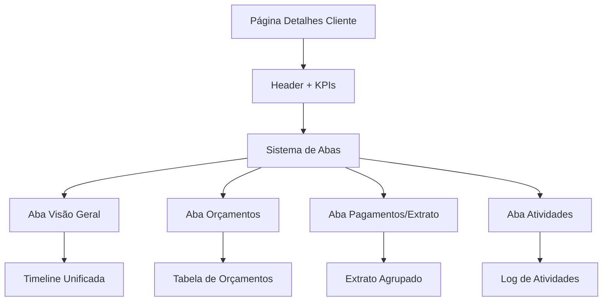

# Página 360° do Cliente - Documento de Requisitos de Produto

## 1. Visão Geral do Produto

Evolução da página atual "Detalhes do Cliente" para uma experiência 360° completa, mantendo todas as funcionalidades existentes (extrato de pagamentos e geração de PDF) e adicionando contexto abrangente de orçamentos, timeline de eventos e KPIs estratégicos. O objetivo é centralizar todas as informações do cliente em uma interface organizada por abas, proporcionando visão holística do relacionamento comercial.

## 2. Funcionalidades Principais

### 2.1 Papéis de Usuário

| Papel | Método de Acesso | Permissões Principais |
|-------|------------------|----------------------|
| Usuário Autenticado | Login no sistema | Visualizar detalhes completos do cliente, gerar relatórios, criar orçamentos |

### 2.2 Módulos de Funcionalidade

Nossa página 360° do cliente consiste nas seguintes seções principais:

1. **Header do Cliente**: informações básicas, tags de status e ações rápidas
2. **Dashboard de KPIs**: métricas resumidas de performance comercial
3. **Sistema de Abas**: organização do conteúdo em Visão Geral, Orçamentos, Pagamentos/Extrato e Atividades
4. **Timeline Unificada**: histórico cronológico de eventos importantes
5. **Gestão de Orçamentos**: tabela detalhada com status e ações
6. **Extrato Melhorado**: agrupamento por orçamento com totalizadores

### 2.3 Detalhes das Páginas

| Nome da Página | Nome do Módulo | Descrição da Funcionalidade |
|----------------|----------------|-----------------------------|
| Página 360° do Cliente | Header do Cliente | Exibir nome do cliente, tags de status (ativo, recorrente, prioridade), botões de ação rápida (Novo Orçamento, Gerar Extrato PDF, Exportar CSV, Enviar mensagem) |
| Página 360° do Cliente | Dashboard de KPIs | Mostrar métricas: orçamentos enviados, taxa de aprovação, receita total paga, valor a receber |
| Página 360° do Cliente | Aba Visão Geral | Timeline unificada com eventos de orçamentos, pagamentos, visualizações e alertas. Filtros por tipo e período |
| Página 360° do Cliente | Aba Orçamentos | Tabela detalhada com título/ID, status com badges coloridos, valores (total/pago/pendente), prazos, ações (abrir, PDF, lembrete, duplicar, mover para portfólio) |
| Página 360° do Cliente | Aba Pagamentos/Extrato | Manter funcionalidade atual, adicionar agrupamento por orçamento em accordion, totalizadores, filtros aprimorados |
| Página 360° do Cliente | Aba Atividades | Registro de ações internas para auditoria (quem editou, enviou, aprovou orçamentos) |

## 3. Processo Principal

O usuário acessa a página de detalhes do cliente e navega entre as abas para obter diferentes perspectivas dos dados:

1. **Visão Inicial**: Header com informações básicas e KPIs resumidos
2. **Navegação por Abas**: Sistema de tabs para organizar informações
3. **Visão Geral**: Timeline cronológica de todos os eventos
4. **Gestão de Orçamentos**: Tabela com filtros e ações por orçamento
5. **Análise Financeira**: Extrato agrupado por orçamento com totalizadores
6. **Auditoria**: Histórico de atividades internas (opcional)

## 4. Design da Interface

### 4.1 Estilo de Design

- **Cores Primárias**: Azul (#3B82F6) para ações principais, Verde (#10B981) para valores positivos
- **Cores Secundárias**: Vermelho (#EF4444) para alertas, Âmbar (#F59E0B) para pendências
- **Estilo de Botões**: Arredondados com sombra sutil, hover com transição suave
- **Tipografia**: Inter ou similar, tamanhos 14px (corpo), 16px (títulos), 12px (labels)
- **Layout**: Sistema de cards com bordas arredondadas, espaçamento consistente de 1.5rem
- **Ícones**: Heroicons ou Lucide para consistência visual

### 4.2 Visão Geral do Design das Páginas

| Nome da Página | Nome do Módulo | Elementos da UI |
|----------------|----------------|----------------|
| Página 360° do Cliente | Header do Cliente | Card branco com nome em H1, tags como badges coloridos, botões de ação em linha horizontal |
| Página 360° do Cliente | Dashboard de KPIs | Grid 2x2 de cards com ícones, valores grandes em destaque, cores semânticas |
| Página 360° do Cliente | Sistema de Abas | Flowbite Tabs com indicador ativo, transições suaves entre conteúdos |
| Página 360° do Cliente | Timeline | Lista vertical com ícones coloridos, timestamps relativos, links para orçamentos |
| Página 360° do Cliente | Tabela Orçamentos | DataTable responsiva com badges de status, filtros no topo, ações por linha |
| Página 360° do Cliente | Extrato Agrupado | Accordions por orçamento, tabelas internas de pagamentos, totalizadores destacados |

### 4.3 Responsividade

Design mobile-first com adaptação para desktop. Em telas menores, as abas se transformam em dropdown, KPIs empilham verticalmente e tabelas ganham scroll horizontal. Otimização para touch em dispositivos móveis.