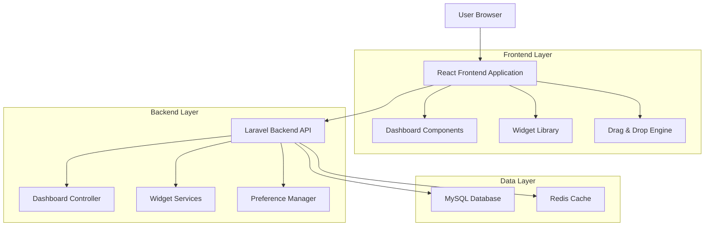
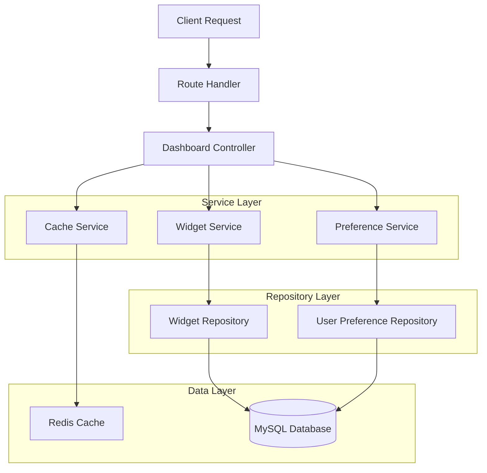
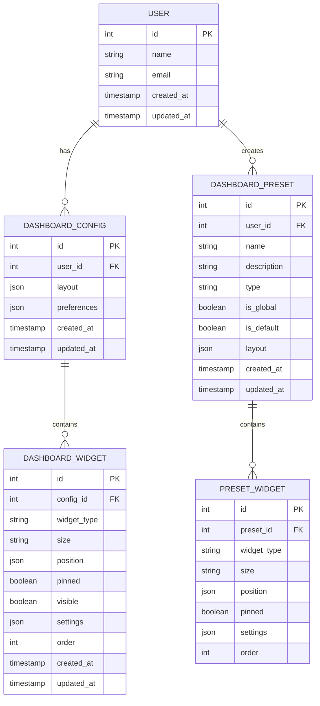

## 1. Architecture design



## 2. Technology Description

* Frontend: React\@18 + TypeScript + Tailwind CSS + Framer Motion + React DnD

* Backend: Laravel\@10 + Livewire\@3

* Database: MySQL\@8.0

* Cache: Redis\@7.0

* Real-time: Laravel Echo + Pusher

## 3. Route definitions

| Route                     | Purpose                            |
| ------------------------- | ---------------------------------- |
| /admin/dashboard          | Dashboard principal personalizável |
| /admin/dashboard/edit     | Modo de edição do dashboard        |
| /admin/dashboard/presets  | Gerenciamento de presets           |
| /admin/dashboard/settings | Configurações de preferências      |

## 4. API definitions

### 4.1 Core API

**Dashboard Configuration**

```
GET /api/dashboard/config
```

Response:

| Param Name  | Param Type | Description                                |
| ----------- | ---------- | ------------------------------------------ |
| widgets     | array      | Lista de widgets configurados pelo usuário |
| layout      | object     | Configuração de layout (grid, posições)    |
| preferences | object     | Preferências do usuário                    |

Example:

```json
{
  "widgets": [
    {
      "id": "financial-summary",
      "type": "financial_summary",
      "size": "large",
      "position": { "x": 0, "y": 0, "w": 2, "h": 2 },
      "pinned": true,
      "visible": true
    }
  ],
  "layout": {
    "columns": 4,
    "rowHeight": 120
  },
  "preferences": {
    "preset": "productivity",
    "animations": true
  }
}
```

**Save Dashboard Configuration**

```
POST /api/dashboard/config
```

Request:

| Param Name  | Param Type | isRequired | Description              |
| ----------- | ---------- | ---------- | ------------------------ |
| widgets     | array      | true       | Configuração dos widgets |
| layout      | object     | true       | Layout do dashboard      |
| preferences | object     | false      | Preferências do usuário  |

**Widget Data**

```
GET /api/dashboard/widget/{type}
```

Response:

| Param Name  | Param Type | Description                  |
| ----------- | ---------- | ---------------------------- |
| data        | object     | Dados específicos do widget  |
| lastUpdated | timestamp  | Última atualização dos dados |
| cacheExpiry | integer    | Tempo de cache em segundos   |

**Available Widgets**

```
GET /api/dashboard/widgets/available
```

Response:

| Param Name | Param Type | Description                  |
| ---------- | ---------- | ---------------------------- |
| widgets    | array      | Lista de widgets disponíveis |

Example:

```json
{
  "widgets": [
    {
      "id": "financial_summary",
      "name": "Resumo Financeiro",
      "description": "Visão geral das finanças",
      "icon": "currency-dollar",
      "sizes": ["small", "medium", "large"],
      "category": "financial"
    }
  ]
}
```

**Presets Management**

```
GET /api/dashboard/presets
POST /api/dashboard/presets
PUT /api/dashboard/presets/{id}
DELETE /api/dashboard/presets/{id}
```

## 5. Server architecture diagram



## 6. Data model

### 6.1 Data model definition



### 6.2 Data Definition Language

**Dashboard Configuration Table (dashboard\_configs)**

```sql
CREATE TABLE dashboard_configs (
    id BIGINT UNSIGNED AUTO_INCREMENT PRIMARY KEY,
    user_id BIGINT UNSIGNED NOT NULL,
    layout JSON NOT NULL DEFAULT '{}',
    preferences JSON NOT NULL DEFAULT '{}',
    created_at TIMESTAMP NULL DEFAULT NULL,
    updated_at TIMESTAMP NULL DEFAULT NULL,
    FOREIGN KEY (user_id) REFERENCES users(id) ON DELETE CASCADE,
    UNIQUE KEY unique_user_config (user_id)
);
```

**Dashboard Widgets Table (dashboard\_widgets)**

```sql
CREATE TABLE dashboard_widgets (
    id BIGINT UNSIGNED AUTO_INCREMENT PRIMARY KEY,
    config_id BIGINT UNSIGNED NOT NULL,
    widget_type VARCHAR(100) NOT NULL,
    size ENUM('small', 'medium', 'large') NOT NULL DEFAULT 'medium',
    position JSON NOT NULL DEFAULT '{}',
    pinned BOOLEAN NOT NULL DEFAULT FALSE,
    visible BOOLEAN NOT NULL DEFAULT TRUE,
    settings JSON NOT NULL DEFAULT '{}',
    order_index INT NOT NULL DEFAULT 0,
    created_at TIMESTAMP NULL DEFAULT NULL,
    updated_at TIMESTAMP NULL DEFAULT NULL,
    FOREIGN KEY (config_id) REFERENCES dashboard_configs(id) ON DELETE CASCADE,
    INDEX idx_config_order (config_id, order_index),
    INDEX idx_widget_type (widget_type)
);
```

**Dashboard Presets Table (dashboard\_presets)**

```sql
CREATE TABLE dashboard_presets (
    id BIGINT UNSIGNED AUTO_INCREMENT PRIMARY KEY,
    user_id BIGINT UNSIGNED NULL,
    name VARCHAR(100) NOT NULL,
    description TEXT NULL,
    type ENUM('productivity', 'financial', 'projects', 'custom') NOT NULL,
    is_global BOOLEAN NOT NULL DEFAULT FALSE,
    is_default BOOLEAN NOT NULL DEFAULT FALSE,
    layout JSON NOT NULL DEFAULT '{}',
    created_at TIMESTAMP NULL DEFAULT NULL,
    updated_at TIMESTAMP NULL DEFAULT NULL,
    FOREIGN KEY (user_id) REFERENCES users(id) ON DELETE SET NULL,
    INDEX idx_preset_type (type),
    INDEX idx_global_presets (is_global, is_default)
);
```

**Preset Widgets Table (preset\_widgets)**

```sql
CREATE TABLE preset_widgets (
    id BIGINT UNSIGNED AUTO_INCREMENT PRIMARY KEY,
    preset_id BIGINT UNSIGNED NOT NULL,
    widget_type VARCHAR(100) NOT NULL,
    size ENUM('small', 'medium', 'large') NOT NULL DEFAULT 'medium',
    position JSON NOT NULL DEFAULT '{}',
    pinned BOOLEAN NOT NULL DEFAULT FALSE,
    settings JSON NOT NULL DEFAULT '{}',
    order_index INT NOT NULL DEFAULT 0,
    FOREIGN KEY (preset_id) REFERENCES dashboard_presets(id) ON DELETE CASCADE,
    INDEX idx_preset_order (preset_id, order_index)
);
```

**Widget Cache Table (widget\_cache)**

```sql
CREATE TABLE widget_cache (
    id BIGINT UNSIGNED AUTO_INCREMENT PRIMARY KEY,
    widget_type VARCHAR(100) NOT NULL,
    user_id BIGINT UNSIGNED NULL,
    cache_key VARCHAR(255) NOT NULL,
    data JSON NOT NULL,
    expires_at TIMESTAMP NOT NULL,
    created_at TIMESTAMP NULL DEFAULT NULL,
    updated_at TIMESTAMP NULL DEFAULT NULL,
    FOREIGN KEY (user_id) REFERENCES users(id) ON DELETE CASCADE,
    UNIQUE KEY unique_cache_key (cache_key),
    INDEX idx_widget_user (widget_type, user_id),
    INDEX idx_expires (expires_at)
);
```

**Initial Data**

```sql
-- Default Presets
INSERT INTO dashboard_presets (name, description, type, is_global, is_default, layout) VALUES
('Produtividade', 'Layout focado em produtividade e tarefas', 'productivity', TRUE, FALSE, '{"columns": 4, "rowHeight": 120}'),
('Financeiro', 'Layout focado em métricas financeiras', 'financial', TRUE, FALSE, '{"columns": 4, "rowHeight": 120}'),
('Projetos', 'Layout focado em gestão de projetos', 'projects', TRUE, FALSE, '{"columns": 4, "rowHeight": 120}');

-- Default Preset Widgets
INSERT INTO preset_widgets (preset_id, widget_type, size, position, pinned, order_index) VALUES
-- Produtividade
(1, 'shortcuts', 'small', '{"x": 0, "y": 0, "w": 1, "h": 1}', FALSE, 1),
(1, 'upcoming_deadlines', 'medium', '{"x": 1, "y": 0, "w": 2, "h": 2}', TRUE, 2),
(1, 'recent_activity', 'small', '{"x": 3, "y": 0, "w": 1, "h": 1}', FALSE, 3),
(1, 'notifications', 'small', '{"x": 0, "y": 1, "w": 1, "h": 1}', FALSE, 4),
(1, 'pipeline', 'large', '{"x": 0, "y": 2, "w": 4, "h": 2}', FALSE, 5),

-- Financeiro
(2, 'financial_summary', 'large', '{"x": 0, "y": 0, "w": 4, "h": 2}', TRUE, 1),
(2, 'top_clients', 'medium', '{"x": 0, "y": 2, "w": 2, "h": 2}', FALSE, 2),
(2, 'budgets', 'medium', '{"x": 2, "y": 2, "w": 2, "h": 2}', FALSE, 3),
(2, 'portfolio_metrics', 'small', '{"x": 0, "y": 4, "w": 1, "h": 1}', FALSE, 4),

-- Projetos
(3, 'pipeline', 'large', '{"x": 0, "y": 0, "w": 4, "h": 2}', TRUE, 1),
(3, 'upcoming_deadlines', 'medium', '{"x": 0, "y": 2, "w": 2, "h": 2}', FALSE, 2),
(3, 'recent_activity', 'medium', '{"x": 2, "y": 2, "w": 2, "h": 2}', FALSE, 3),
(3, 'shortcuts', 'small', '{"x": 0, "y": 4, "w": 1, "h": 1}', FALSE, 4);
```

## 7. Widget Types Configuration

### 7.1 Available Widget Types

```json
{
  "financial_summary": {
    "name": "Resumo Financeiro",
    "description": "Receitas, despesas e saldo atual",
    "icon": "currency-dollar",
    "sizes": ["medium", "large"],
    "category": "financial",
    "refreshInterval": 300,
    "cacheTime": 600
  },
  "budgets": {
    "name": "Orçamentos",
    "description": "Status de orçamentos pendentes e aprovados",
    "icon": "document-text",
    "sizes": ["small", "medium", "large"],
    "category": "business",
    "refreshInterval": 180,
    "cacheTime": 300
  },
  "upcoming_deadlines": {
    "name": "Prazos Próximos",
    "description": "Tarefas e projetos com deadline próximo",
    "icon": "clock",
    "sizes": ["small", "medium"],
    "category": "productivity",
    "refreshInterval": 120,
    "cacheTime": 180
  },
  "pipeline": {
    "name": "Pipeline",
    "description": "Funil de vendas e projetos",
    "icon": "chart-bar",
    "sizes": ["medium", "large"],
    "category": "business",
    "refreshInterval": 300,
    "cacheTime": 600
  },
  "notifications": {
    "name": "Notificações",
    "description": "Alertas e mensagens recentes",
    "icon": "bell",
    "sizes": ["small", "medium"],
    "category": "communication",
    "refreshInterval": 60,
    "cacheTime": 120
  },
  "top_clients": {
    "name": "Top Clientes",
    "description": "Clientes mais ativos ou rentáveis",
    "icon": "users",
    "sizes": ["small", "medium"],
    "category": "business",
    "refreshInterval": 600,
    "cacheTime": 1200
  },
  "shortcuts": {
    "name": "Atalhos",
    "description": "Links rápidos para ações frequentes",
    "icon": "lightning-bolt",
    "sizes": ["small"],
    "category": "productivity",
    "refreshInterval": 0,
    "cacheTime": 0
  },
  "recent_activity": {
    "name": "Atividade Recente",
    "description": "Log de ações recentes no sistema",
    "icon": "clock",
    "sizes": ["small", "medium"],
    "category": "productivity",
    "refreshInterval": 120,
    "cacheTime": 180
  },
  "portfolio_metrics": {
    "name": "Métricas de Portfólio",
    "description": "Estatísticas de projetos e performance",
    "icon": "chart-pie",
    "sizes": ["small", "medium", "large"],
    "category": "analytics",
    "refreshInterval": 600,
    "cacheTime": 1200
  }
}
```

