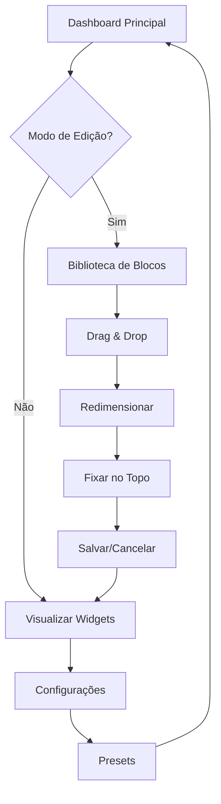

## 1. Product Overview

Dashboard personalizável para o sistema admin que permite aos usuários configurar sua interface de trabalho escolhendo quais widgets visualizar, sua ordem, tamanho e posicionamento.

O produto resolve o problema de interfaces rígidas, permitindo que cada usuário adapte o dashboard às suas necessidades específicas de trabalho, aumentando produtividade e satisfação.

Objetivo: Criar uma experiência de dashboard altamente customizável que se adapte ao fluxo de trabalho individual de cada usuário.

## 2. Core Features

### 2.1 User Roles

| Role    | Registration Method      | Core Permissions                                             |
| ------- | ------------------------ | ------------------------------------------------------------ |
| Admin   | Acesso direto ao sistema | Pode definir layouts padrão, gerenciar presets globais       |
| Usuário | Login no sistema         | Pode personalizar seu próprio dashboard, salvar preferências |

### 2.2 Feature Module

Nosso dashboard personalizável consiste nas seguintes páginas principais:

1. **Dashboard Principal**: área de trabalho personalizável, biblioteca de blocos, controles de edição
2. **Configurações de Dashboard**: gerenciamento de presets, preferências de usuário, layouts salvos

### 2.3 Page Details

| Page Name                  | Module Name               | Feature description                                                                                                                                                              |
| -------------------------- | ------------------------- | -------------------------------------------------------------------------------------------------------------------------------------------------------------------------------- |
| Dashboard Principal        | Área de Trabalho          | Exibir widgets selecionados em grid responsivo, atualização individual dos blocos, cache leve                                                                                    |
| Dashboard Principal        | Modo de Edição            | Ativar/desativar modo de edição, mostrar controles de personalização                                                                                                             |
| Dashboard Principal        | Biblioteca de Blocos      | Painel lateral com widgets disponíveis (Resumo Financeiro, Orçamentos, Prazos Próximos, Pipeline, Notificações, Top Clientes, Atalhos, Atividade Recente, Métricas de Portfólio) |
| Dashboard Principal        | Sistema Drag & Drop       | Arrastar e soltar widgets, grid com snap, redimensionamento (S/M/L)                                                                                                              |
| Dashboard Principal        | Fixação de Blocos         | Fixar até 3 widgets no topo, prioridade de exibição                                                                                                                              |
| Dashboard Principal        | Controles de Ação         | Salvar/cancelar mudanças, toasts de feedback                                                                                                                                     |
| Dashboard Principal        | Skeletons de Carregamento | Indicadores visuais durante carregamento de dados                                                                                                                                |
| Configurações de Dashboard | Presets                   | Templates predefinidos (Produtividade, Financeiro, Projetos)                                                                                                                     |
| Configurações de Dashboard | Preferências              | Salvar configurações por usuário, layout padrão do admin                                                                                                                         |

## 3. Core Process

### Fluxo Principal do Usuário

1. **Visualização Normal**: Usuário acessa dashboard com widgets configurados, dados carregam individualmente com skeletons
2. **Modo de Edição**: Usuário ativa modo de edição, biblioteca de blocos aparece lateralmente
3. **Personalização**: Usuário arrasta widgets da biblioteca, redimensiona blocos, reordena elementos
4. **Fixação**: Usuário pode fixar até 3 widgets no topo para acesso prioritário
5. **Salvamento**: Usuário salva configurações ou cancela mudanças, recebe feedback via toast

### Fluxo de Presets

1. **Seleção de Preset**: Usuário escolhe template predefinido (Produtividade, Financeiro, Projetos)
2. **Aplicação**: Sistema aplica configuração do preset ao dashboard
3. **Personalização**: Usuário pode modificar preset aplicado conforme necessário

## 4. User Interface Design

### 4.1 Design Style

* **Cores Primárias**: Azul (#3B82F6), Cinza (#6B7280)

* **Cores Secundárias**: Verde (#10B981) para sucesso, Vermelho (#EF4444) para alertas

* **Estilo de Botões**: Rounded corners (8px), sombra sutil, hover states

* **Fontes**: Inter 14px para texto, 16px para títulos, 12px para labels

* **Layout**: Grid responsivo, cards com bordas arredondadas, espaçamento consistente (16px/24px)

* **Ícones**: Heroicons outline, tamanho 20px para ações, 16px para indicadores

### 4.2 Page Design Overview

| Page Name           | Module Name          | UI Elements                                                                                    |
| ------------------- | -------------------- | ---------------------------------------------------------------------------------------------- |
| Dashboard Principal | Área de Trabalho     | Grid responsivo 3-4 colunas desktop, cards com sombra sutil, cores de fundo branco/cinza claro |
| Dashboard Principal | Modo de Edição       | Botão toggle azul, overlay semi-transparente, bordas pontilhadas nos drop zones                |
| Dashboard Principal | Biblioteca de Blocos | Drawer lateral 320px, fundo branco, lista de widgets com ícones e descrições                   |
| Dashboard Principal | Widgets              | Cards responsivos, header com título e ações, conteúdo adaptável ao tamanho                    |
| Dashboard Principal | Controles            | Botões flutuantes fixos, toasts no canto superior direito                                      |
| Dashboard Principal | Skeletons            | Animação pulse, cores cinza claro, formas que simulam conteúdo real                            |

### 4.3 Responsividade

Produto desktop-first com adaptação mobile completa:

* **Desktop (1200px+)**: 3-4 colunas, drag & drop completo

* **Tablet (768px-1199px)**: 2 colunas, drag & drop adaptado

* **Mobile (até 767px)**: 1 coluna, reordenação por botões, drawer fullscreen

## 5. Animações e Interações

### 5.1 Animações de Entrada

* Blocos aparecem com fade-in + slide-up (300ms)

* Stagger de 100ms entre blocos para efeito cascata

* Easing: cubic-bezier(0.4, 0, 0.2, 1)

### 5.2 Animações de Drag & Drop

* Bloco arrastado: sombra elevada + scale(1.05)

* Vizinhos: transição suave para abrir espaço (200ms)

* Drop zones: highlight com borda pontilhada animada

### 5.3 Animações de Redimensionamento

* Morph suave do conteúdo durante resize (250ms)

* Reflow automático dos blocos adjacentes

### 5.4 Drawer da Biblioteca

* Slide-in lateral com backdrop (300ms)

* Bounce sutil no final da animação

### 5.5 Acessibilidade

* Respeito à preferência "prefers-reduced-motion"

* Foco visível com outline azul 2px

* Navegação por teclado: Tab, Enter, Escape, Arrow keys

* Screen reader: labels descritivos, live regions para feedback

## 6. Widgets Disponíveis

### 6.1 Lista de Widgets

1. **Resumo Financeiro**: Receitas, despesas, saldo atual
2. **Orçamentos**: Status de orçamentos pendentes, aprovados, rejeitados
3. **Prazos Próximos**: Tarefas e projetos com deadline próximo
4. **Pipeline**: Funil de vendas e projetos em andamento
5. **Notificações**: Alertas e mensagens recentes
6. **Top Clientes**: Clientes mais ativos ou rentáveis
7. **Atalhos**: Links rápidos para ações frequentes
8. **Atividade Recente**: Log de ações recentes no sistema
9. **Métricas de Portfólio**: Estatísticas de projetos e performance

### 6.2 Tamanhos de Widget

* **Small (S)**: 1 coluna, altura mínima

* **Medium (M)**: 2 colunas ou altura dupla

* **Large (L)**: 3+ colunas ou altura tripla

## 7. Sistema de Preferências

### 7.1 Presets Predefinidos

**Produtividade**:

* Atalhos (S), Prazos Próximos (M), Atividade Recente (S)

* Notificações (S), Pipeline (L)

**Financeiro**:

* Resumo Financeiro (L), Top Clientes (M)

* Orçamentos (M), Métricas de Portfólio (S)

**Projetos**:

* Pipeline (L), Prazos Próximos (M)

* Atividade Recente (M), Atalhos (S)

### 7.2 Persistência

* Configurações salvas por usuário no banco de dados

* Cache local para performance

* Sincronização entre dispositivos

* Backup automático das configurações

### 7.3 Configurações de Admin

* Layout padrão para novos usuários

* Widgets obrigatórios que não podem ser removidos

* Limites de personalização por role

* Presets globais editáveis

