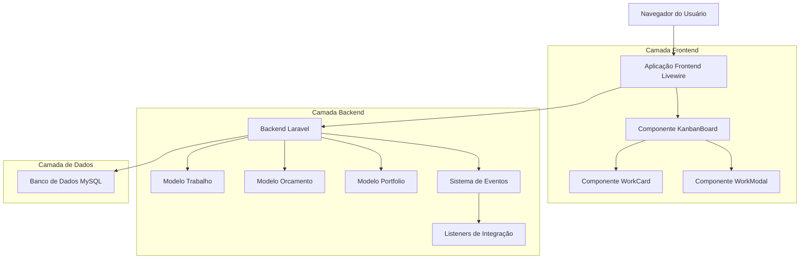
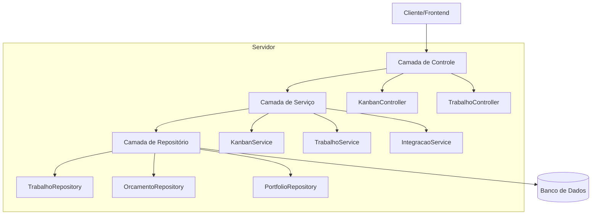
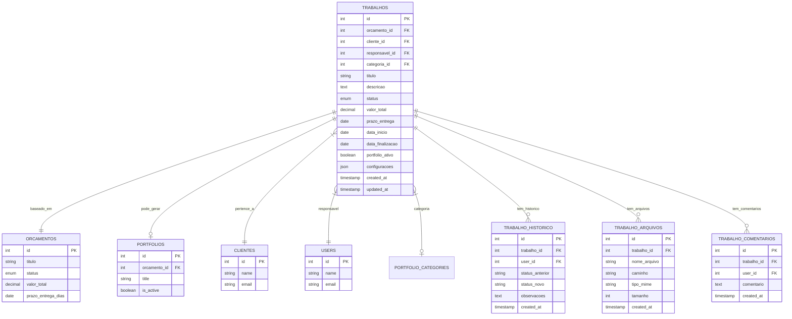

# Sistema Kanban de Trabalhos - Arquitetura Técnica

## 1. Arquitetura do Sistema



## 2. Descrição das Tecnologias

* **Frontend**: Laravel Livewire + Alpine.js + Tailwind CSS + SortableJS

* **Backend**: Laravel 10 + MySQL

* **Autenticação**: Laravel Sanctum

* **Real-time**: Laravel Broadcasting + Pusher (opcional)

* **Cache**: Redis (para métricas e performance)

## 3. Definições de Rotas

| Rota                  | Propósito                            |
| --------------------- | ------------------------------------ |
| /kanban               | Página principal do quadro Kanban    |
| /kanban/trabalho/{id} | Modal de detalhes do trabalho (AJAX) |
| /kanban/metricas      | Endpoint para métricas em tempo real |
| /kanban/config        | Página de configurações do quadro    |

## 4. Definições de API

### 4.1 APIs Principais

**Atualizar status do trabalho**

```
POST /api/trabalhos/{id}/status
```

Request:

| Nome do Parâmetro | Tipo    | Obrigatório | Descrição                                                              |
| ----------------- | ------- | ----------- | ---------------------------------------------------------------------- |
| status            | string  | true        | Novo status: backlog, em\_producao, em\_revisao, finalizado, publicado |
| coluna\_origem    | string  | true        | Status anterior para validação                                         |
| confirmar\_acao   | boolean | false       | Confirmação para ações críticas                                        |

Response:

| Nome do Parâmetro | Tipo    | Descrição                      |
| ----------------- | ------- | ------------------------------ |
| success           | boolean | Status da operação             |
| message           | string  | Mensagem de feedback           |
| trabalho          | object  | Dados atualizados do trabalho  |
| integracoes       | array   | Ações de integração executadas |

Exemplo:

```json
{
  "status": "em_producao",
  "coluna_origem": "backlog",
  "confirmar_acao": true
}
```

**Buscar trabalhos do Kanban**

```
GET /api/kanban/trabalhos
```

Request:

| Nome do Parâmetro | Tipo    | Obrigatório | Descrição                       |
| ----------------- | ------- | ----------- | ------------------------------- |
| cliente\_id       | integer | false       | Filtro por cliente              |
| categoria\_id     | integer | false       | Filtro por categoria            |
| responsavel\_id   | integer | false       | Filtro por responsável          |
| prazo\_inicio     | date    | false       | Filtro por prazo inicial        |
| prazo\_fim        | date    | false       | Filtro por prazo final          |
| busca             | string  | false       | Busca por título ou descrição   |
| agrupar\_cliente  | boolean | false       | Agrupar por cliente (swimlanes) |

Response:

| Nome do Parâmetro | Tipo   | Descrição                                 |
| ----------------- | ------ | ----------------------------------------- |
| trabalhos         | array  | Lista de trabalhos organizados por status |
| metricas          | object | Métricas do quadro                        |
| alertas           | array  | Lista de alertas ativos                   |

**Obter métricas do quadro**

```
GET /api/kanban/metricas
```

Response:

| Nome do Parâmetro    | Tipo    | Descrição                         |
| -------------------- | ------- | --------------------------------- |
| lead\_time\_medio    | float   | Tempo médio em dias               |
| contagem\_por\_fase  | object  | Contadores por coluna             |
| trabalhos\_atrasados | integer | Quantidade de trabalhos atrasados |
| taxa\_retrabalho     | float   | Percentual de retrabalho          |

## 5. Arquitetura do Servidor



## 6. Modelo de Dados

### 6.1 Definição do Modelo de Dados



### 6.2 Linguagem de Definição de Dados

**Tabela de Trabalhos (trabalhos)**

```sql
-- Criar tabela principal
CREATE TABLE trabalhos (
    id BIGINT UNSIGNED AUTO_INCREMENT PRIMARY KEY,
    orcamento_id BIGINT UNSIGNED NOT NULL,
    cliente_id BIGINT UNSIGNED NOT NULL,
    responsavel_id BIGINT UNSIGNED NULL,
    categoria_id BIGINT UNSIGNED NULL,
    titulo VARCHAR(255) NOT NULL,
    descricao TEXT NULL,
    status ENUM('backlog', 'em_producao', 'em_revisao', 'finalizado', 'publicado') DEFAULT 'backlog',
    valor_total DECIMAL(10,2) NOT NULL DEFAULT 0.00,
    prazo_entrega DATE NULL,
    data_inicio DATE NULL,
    data_finalizacao DATE NULL,
    portfolio_ativo BOOLEAN DEFAULT FALSE,
    configuracoes JSON NULL,
    created_at TIMESTAMP DEFAULT CURRENT_TIMESTAMP,
    updated_at TIMESTAMP DEFAULT CURRENT_TIMESTAMP ON UPDATE CURRENT_TIMESTAMP,
    
    FOREIGN KEY (orcamento_id) REFERENCES orcamentos(id) ON DELETE CASCADE,
    FOREIGN KEY (cliente_id) REFERENCES clientes(id) ON DELETE CASCADE,
    FOREIGN KEY (responsavel_id) REFERENCES users(id) ON DELETE SET NULL,
    FOREIGN KEY (categoria_id) REFERENCES portfolio_categories(id) ON DELETE SET NULL
);

-- Criar índices
CREATE INDEX idx_trabalhos_status ON trabalhos(status);
CREATE INDEX idx_trabalhos_cliente ON trabalhos(cliente_id);
CREATE INDEX idx_trabalhos_responsavel ON trabalhos(responsavel_id);
CREATE INDEX idx_trabalhos_prazo ON trabalhos(prazo_entrega);
CREATE INDEX idx_trabalhos_created_at ON trabalhos(created_at DESC);

-- Tabela de histórico
CREATE TABLE trabalho_historico (
    id BIGINT UNSIGNED AUTO_INCREMENT PRIMARY KEY,
    trabalho_id BIGINT UNSIGNED NOT NULL,
    user_id BIGINT UNSIGNED NOT NULL,
    status_anterior VARCHAR(50) NULL,
    status_novo VARCHAR(50) NOT NULL,
    observacoes TEXT NULL,
    created_at TIMESTAMP DEFAULT CURRENT_TIMESTAMP,
    
    FOREIGN KEY (trabalho_id) REFERENCES trabalhos(id) ON DELETE CASCADE,
    FOREIGN KEY (user_id) REFERENCES users(id) ON DELETE CASCADE
);

CREATE INDEX idx_trabalho_historico_trabalho ON trabalho_historico(trabalho_id);
CREATE INDEX idx_trabalho_historico_created_at ON trabalho_historico(created_at DESC);

-- Tabela de arquivos
CREATE TABLE trabalho_arquivos (
    id BIGINT UNSIGNED AUTO_INCREMENT PRIMARY KEY,
    trabalho_id BIGINT UNSIGNED NOT NULL,
    nome_arquivo VARCHAR(255) NOT NULL,
    caminho VARCHAR(500) NOT NULL,
    tipo_mime VARCHAR(100) NOT NULL,
    tamanho INT UNSIGNED NOT NULL,
    created_at TIMESTAMP DEFAULT CURRENT_TIMESTAMP,
    
    FOREIGN KEY (trabalho_id) REFERENCES trabalhos(id) ON DELETE CASCADE
);

CREATE INDEX idx_trabalho_arquivos_trabalho ON trabalho_arquivos(trabalho_id);

-- Tabela de comentários
CREATE TABLE trabalho_comentarios (
    id BIGINT UNSIGNED AUTO_INCREMENT PRIMARY KEY,
    trabalho_id BIGINT UNSIGNED NOT NULL,
    user_id BIGINT UNSIGNED NOT NULL,
    comentario TEXT NOT NULL,
    created_at TIMESTAMP DEFAULT CURRENT_TIMESTAMP,
    
    FOREIGN KEY (trabalho_id) REFERENCES trabalhos(id) ON DELETE CASCADE,
    FOREIGN KEY (user_id) REFERENCES users(id) ON DELETE CASCADE
);

CREATE INDEX idx_trabalho_comentarios_trabalho ON trabalho_comentarios(trabalho_id);
CREATE INDEX idx_trabalho_comentarios_created_at ON trabalho_comentarios(created_at DESC);

-- Dados iniciais
INSERT INTO trabalhos (orcamento_id, cliente_id, responsavel_id, titulo, descricao, status, valor_total, prazo_entrega)
SELECT 
    o.id,
    o.cliente_id,
    o.user_id,
    o.titulo,
    o.descricao,
    CASE 
        WHEN o.status = 'aprovado' THEN 'backlog'
        WHEN p.id IS NOT NULL AND p.is_active = 1 THEN 'publicado'
        ELSE 'backlog'
    END,
    o.valor_total,
    DATE_ADD(o.created_at, INTERVAL o.prazo_entrega_dias DAY)
FROM orcamentos o
LEFT JOIN portfolios p ON p.orcamento_id = o.id
WHERE o.status = 'aprovado';
```

## 7. Componentes Livewire

### 7.1 KanbanBoard (Componente Principal)

**Responsabilidades:**

* Renderizar as 5 colunas do Kanban

* Gerenciar filtros e busca

* Exibir métricas no topo

* Coordenar drag-and-drop entre colunas

**Propriedades:**

* `$trabalhos` - Collection de trabalhos agrupados por status

* `$filtros` - Array com filtros ativos

* `$metricas` - Object com métricas calculadas

* `$swimlanes` - Boolean para agrupar por cliente

### 7.2 WorkCard (Componente de Card)

**Responsabilidades:**

* Renderizar informações do trabalho

* Aplicar cores baseadas em prazo

* Exibir indicadores visuais

* Gerenciar ações rápidas

**Propriedades:**

* `$trabalho` - Model do trabalho

* `$alertas` - Array de alertas para este trabalho

* `$indicadores` - Object com status de pagamentos/arquivos

### 7.3 WorkModal (Componente de Detalhes)

**Responsabilidades:**

* Exibir detalhes completos do trabalho

* Gerenciar histórico e comentários

* Permitir upload de arquivos

* Executar ações de integração

**Propriedades:**

* `$trabalho` - Model do trabalho

* `$historico` - Collection do histórico

* `$comentarios` - Collection de comentários

* `$arquivos` - Collection de arquivos

## 8. Eventos e Listeners

### 8.1 Eventos do Sistema

* `TrabalhoStatusAlterado` - Disparado quando status muda

* `TrabalhoMovidoParaProducao` - Integração com orçamento

* `TrabalhoFinalizado` - Sugestão de lançamento financeiro

* `TrabalhoPublicado` - Ativação no portfólio

### 8.2 Listeners de Integração

* `VincularOrcamentoAprovado` - Vincula trabalho ao orçamento

* `SugerirLancamentoReceita` - Cria sugestão financeira

* `AtivarNoPortfolio` - Cria/ativa item no portfólio

* `EnviarNotificacaoStatus` - Notifica mudanças de status

## 9. Performance e Cache

### 9.1 Estratégias de Cache

* Cache de métricas por 5 minutos

* Cache de contadores por coluna por 2 minutos

* Cache de filtros de cliente/categoria por 30 minutos

### 9.2 Otimizações

* Lazy loading para detalhes de trabalhos

* Paginação virtual para muitos trabalhos

* Debounce em filtros de busca

* Eager loading de relacionamentos essenciais

