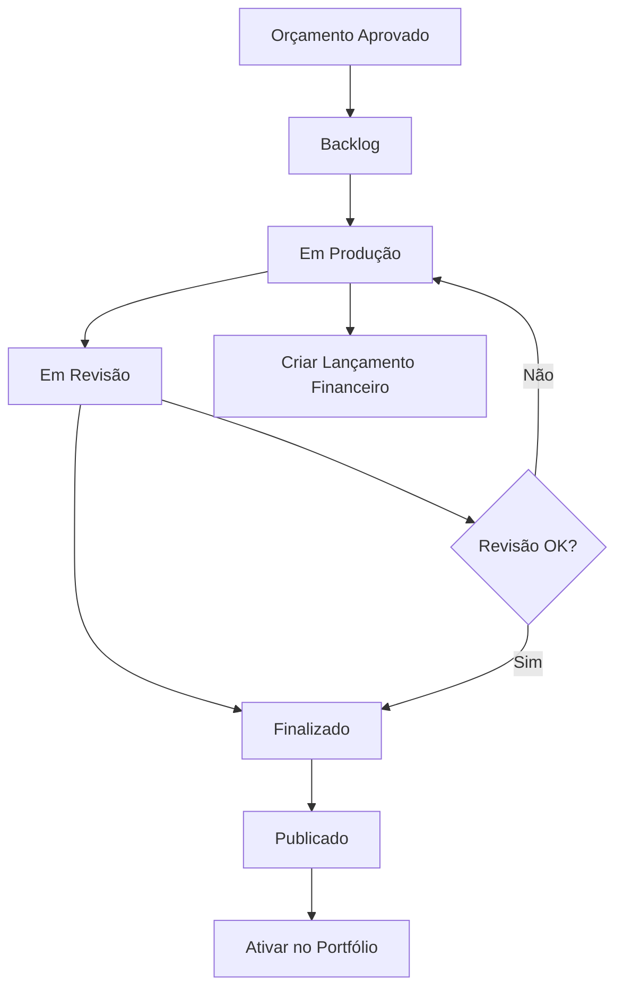

# Sistema Kanban de Trabalhos - Documento de Requisitos do Produto

## 1. Visão Geral do Produto

O Sistema Kanban de Trabalhos é uma ferramenta de gestão visual que permite acompanhar o fluxo completo de produção de projetos, desde a aprovação do orçamento até a publicação no portfólio. O sistema oferece uma interface intuitiva de arrastar e soltar para movimentar trabalhos entre diferentes estágios, proporcionando visibilidade clara do pipeline de produção e facilitando a identificação de gargalos.

O objetivo principal é reduzir atrasos, melhorar a comunicação da equipe e automatizar processos através de integrações com os sistemas de orçamento, portfólio e financeiro existentes.

## 2. Funcionalidades Principais

### 2.1 Papéis de Usuário

| Papel                  | Método de Registro           | Permissões Principais                                              |
| ---------------------- | ---------------------------- | ------------------------------------------------------------------ |
| Administrador          | Acesso total ao sistema      | Pode visualizar, mover e gerenciar todos os trabalhos              |
| Gerente de Projeto     | Atribuição por administrador | Pode mover trabalhos entre colunas e gerenciar projetos atribuídos |
| Designer/Desenvolvedor | Atribuição por administrador | Pode atualizar status e visualizar trabalhos atribuídos            |

### 2.2 Módulos de Funcionalidade

Nosso sistema Kanban consiste nas seguintes páginas principais:

1. **Quadro Kanban Principal**: visualização das colunas, cards de trabalhos, filtros e métricas
2. **Detalhes do Trabalho**: modal com informações completas, histórico e ações rápidas
3. **Configurações do Quadro**: personalização de colunas, alertas e notificações

### 2.3 Detalhes das Páginas

| Nome da Página          | Nome do Módulo    | Descrição da Funcionalidade                                                                                     |
| ----------------------- | ----------------- | --------------------------------------------------------------------------------------------------------------- |
| Quadro Kanban Principal | Colunas do Kanban | Exibir 5 colunas: Backlog, Em produção, Em revisão, Finalizado, Publicado. Permitir drag-and-drop entre colunas |
| Quadro Kanban Principal | Cards de Trabalho | Mostrar título, cliente, prazo com cores, valor, status do orçamento, indicadores de pagamento/arquivos         |
| Quadro Kanban Principal | Filtros e Busca   | Filtrar por cliente, categoria, responsável, prazo. Busca por texto. Agrupar por cliente (swimlanes)            |
| Quadro Kanban Principal | Métricas do Topo  | Exibir lead time médio, contagem por fase, trabalhos atrasados, taxa de retrabalho                              |
| Quadro Kanban Principal | Alertas Visuais   | Destacar cards com prazo próximo/vencido, orçamentos visualizados sem aprovação                                 |
| Detalhes do Trabalho    | Modal de Detalhes | Mostrar informações completas, histórico de movimentações, arquivos anexos                                      |
| Detalhes do Trabalho    | Ações Rápidas     | Enviar lembrete, criar lançamento financeiro, ativar no portfólio                                               |
| Configurações do Quadro | Personalização    | Configurar alertas de prazo, notificações, responsáveis padrão                                                  |

## 3. Processo Principal

### Fluxo do Usuário Administrador/Gerente:

1. Acessa o quadro Kanban e visualiza todos os trabalhos organizados por colunas
2. Aplica filtros conforme necessário (cliente, prazo, responsável)
3. Arrasta cards entre colunas para atualizar status dos trabalhos
4. Recebe confirmações automáticas para ações críticas (mover para Publicado)
5. Utiliza ações rápidas diretamente nos cards (enviar lembrete, criar receita)
6. Monitora métricas de performance no topo do quadro

### Fluxo do Designer/Desenvolvedor:

1. Visualiza trabalhos atribuídos a ele
2. Atualiza status conforme progresso do trabalho
3. Adiciona comentários e anexa arquivos quando necessário
4. Move trabalhos para "Em revisão" quando concluído

## 4. Design da Interface do Usuário

### 4.1 Estilo de Design

* **Cores Primárias**: Azul (#3B82F6) para ações principais, Verde (#10B981) para status positivos

* **Cores Secundárias**: Cinza (#6B7280) para textos, Vermelho (#EF4444) para alertas

* **Estilo dos Botões**: Arredondados com sombra sutil, hover com transição suave

* **Fonte**: Inter ou system-ui, tamanhos 12px-16px para textos, 18px-24px para títulos

* **Layout**: Grid responsivo com cards, navegação superior fixa

* **Ícones**: Heroicons ou Feather icons para consistência

### 4.2 Visão Geral do Design das Páginas

| Nome da Página          | Nome do Módulo      | Elementos da UI                                                                                    |
| ----------------------- | ------------------- | -------------------------------------------------------------------------------------------------- |
| Quadro Kanban Principal | Header com Métricas | Barra superior com 4 cards de métricas: lead time, contadores, alertas. Fundo branco, bordas sutis |
| Quadro Kanban Principal | Área de Filtros     | Barra horizontal com dropdowns, campo de busca, toggle para swimlanes. Fundo cinza claro           |
| Quadro Kanban Principal | Colunas Kanban      | 5 colunas verticais com headers coloridos, área de drop destacada, scroll vertical                 |
| Quadro Kanban Principal | Cards de Trabalho   | Cards brancos com sombra, título em negrito, badges coloridos para status, ícones para indicadores |
| Detalhes do Trabalho    | Modal Overlay       | Modal centralizado com fundo escuro semi-transparente, conteúdo em card branco                     |
| Detalhes do Trabalho    | Tabs de Conteúdo    | Navegação por abas: Detalhes, Histórico, Arquivos, Comentários                                     |

### 4.3 Responsividade

O sistema é mobile-first com adaptação para desktop. Em dispositivos móveis, exibe uma coluna por vez com navegação horizontal por swipe. Inclui otimização para touch com áreas de toque ampliadas e feedback visual imediato.

## 5. Regras de Negócio

### 5.1 Movimentação entre Colunas

* **Backlog → Em Produção**: Vincula automaticamente ao orçamento aprovado

* **Em Produção → Em Revisão**: Permite apenas se houver progresso registrado

* **Em Revisão → Finalizado**: Remove automaticamente avisos de revisão pendente

* **Finalizado → Publicado**: Pergunta se deve criar/ativar item no portfólio

* **Publicado**: Aceita apenas trabalhos finalizados (ou exige confirmação)

### 5.2 Alertas e Notificações

* Cards com prazo em 3 dias ou menos: borda amarela

* Cards com prazo vencido: borda vermelha

* Orçamentos visualizados há mais de 7 dias sem aprovação: ícone de alerta

* Trabalhos parados em "Em Revisão" por mais de 2 dias: destaque especial

### 5.3 Integrações Automáticas

* **Em Produção**: Cria vínculo com orçamento aprovado, inicia contagem de prazo

* **Finalizado**: Sugere criar lançamento de receita se não existir

* **Publicado**: Cria/ativa trabalho no portfólio usando dados cadastrados

## 6. Métricas e Indicadores

### 6.1 Métricas do Topo

* **Lead Time Médio**: Tempo médio desde aprovação até publicação

* **Contagem por Fase**: Número de trabalhos em cada coluna

* **Trabalhos Atrasados**: Quantidade com prazo vencido

* **Taxa de Retrabalho**: Percentual de trabalhos que retornaram de "Em Revisão"

### 6.2 Indicadores nos Cards

* **Pagamentos**: Ícone verde se pago, amarelo se parcial, vermelho se pendente

* **Arquivos**: Ícone com contador de arquivos anexos

* **Pronto para Portfólio**: Ícone indicando se tem thumb e descrição

* **Prazo**: Cor de fundo baseada na proximidade do vencimento

## 7. Acessibilidade e Usabilidade

### 7.1 Navegação por Teclado

* Tab para navegar entre cards

* Enter para abrir detalhes

* Setas para mover entre colunas

* Esc para fechar modais

### 7.2 Responsividade Mobile

* Uma coluna por vez em telas pequenas

* Swipe horizontal para navegar entre colunas

* Botões de ação ampliados para touch

* Menu hambúrguer para filtros

### 7.3 Feedback Visual

* Animações suaves para drag-and-drop

* Loading states durante operações

* Confirmações visuais para ações importantes

* Tooltips explicativos em ícones

