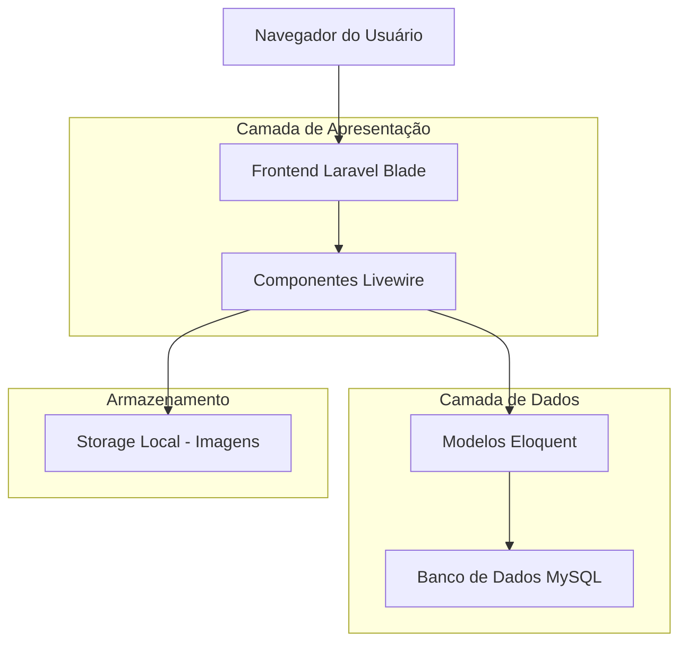
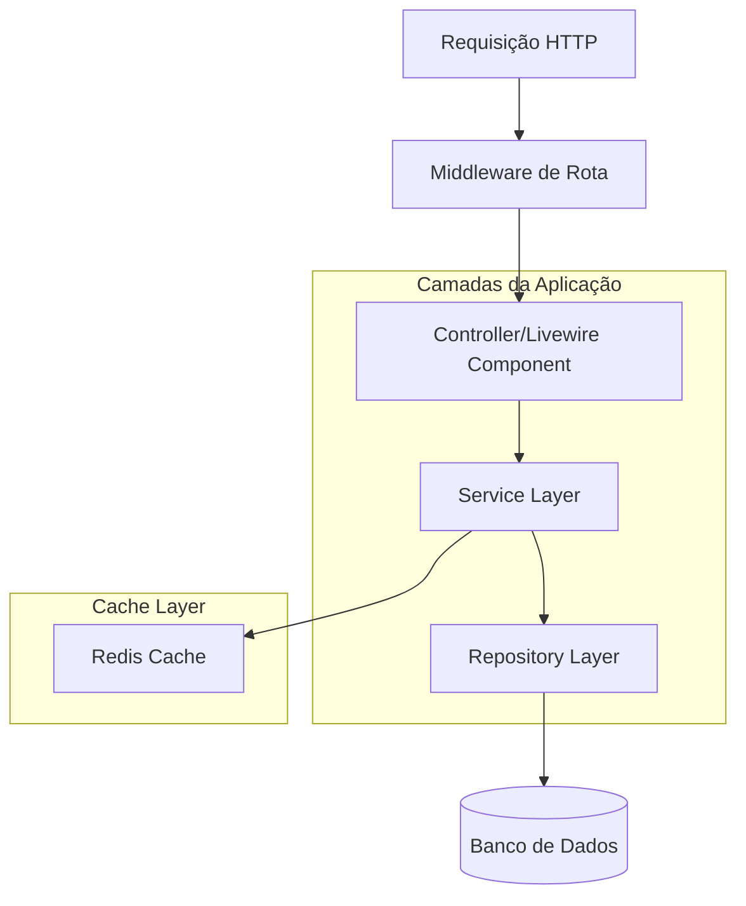
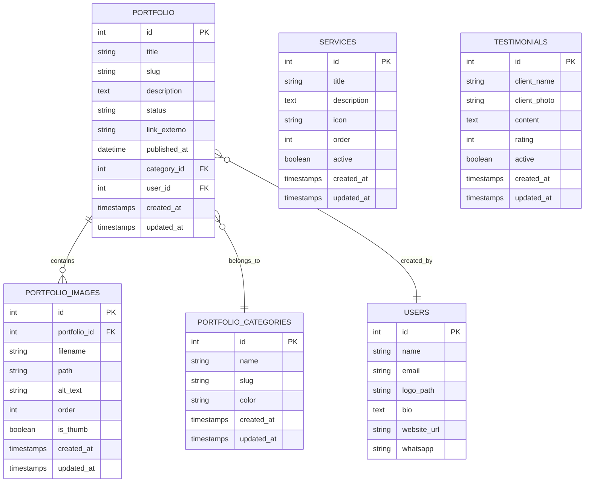

# Documento de Arquitetura Técnica - Portfólio Público

## 1. Arquitetura do Sistema



## 2. Descrição das Tecnologias

* **Frontend**: Laravel Blade Templates + Livewire + TailwindCSS + Alpine.js

* **Backend**: Laravel 10+ com Eloquent ORM

* **Banco de Dados**: MySQL (utilizando estrutura existente)

* **Armazenamento**: Laravel Storage (local/S3)

* **Cache**: Redis (opcional para performance)

## 3. Definições de Rotas

| Rota                               | Propósito                                   |
| ---------------------------------- | ------------------------------------------- |
| `/portfolio`                       | Página principal do portfólio público       |
| `/portfolio/{slug}`                | Página individual de um trabalho específico |
| `/portfolio/categoria/{categoria}` | Listagem filtrada por categoria             |
| `/servicos`                        | Página de apresentação dos serviços         |
| `/sobre`                           | Página sobre o profissional/empresa         |
| `/contato`                         | Página de contato com formulário            |
| `/api/portfolio/search`            | API para busca de trabalhos (AJAX)          |

## 4. Definições de API

### 4.1 APIs Internas (AJAX)

**Busca de trabalhos**

```
GET /api/portfolio/search
```

Request:

| Parâmetro | Tipo    | Obrigatório | Descrição                    |
| --------- | ------- | ----------- | ---------------------------- |
| query     | string  | false       | Termo de busca               |
| categoria | string  | false       | Slug da categoria            |
| page      | integer | false       | Número da página (padrão: 1) |
| per\_page | integer | false       | Itens por página (padrão: 9) |

Response:

| Parâmetro  | Tipo   | Descrição                       |
| ---------- | ------ | ------------------------------- |
| data       | array  | Lista de trabalhos              |
| meta       | object | Informações de paginação        |
| categories | array  | Lista de categorias disponíveis |

Exemplo de Response:

```json
{
  "data": [
    {
      "id": 1,
      "title": "Ilustração Livro Infantil",
      "slug": "ilustracao-livro-infantil",
      "category": "Ilustração",
      "thumb_url": "/storage/portfolio/thumb_1.jpg",
      "published_at": "2024-01-15"
    }
  ],
  "meta": {
    "current_page": 1,
    "total": 25,
    "per_page": 9
  }
}
```

**Envio de formulário de contato**

```
POST /api/contato
```

Request:

| Parâmetro | Tipo   | Obrigatório | Descrição                        |
| --------- | ------ | ----------- | -------------------------------- |
| nome      | string | true        | Nome do interessado              |
| email     | string | true        | Email para contato               |
| telefone  | string | false       | Telefone/WhatsApp                |
| mensagem  | string | true        | Mensagem ou descrição do projeto |
| servico   | string | false       | Tipo de serviço de interesse     |

Response:

| Parâmetro | Tipo    | Descrição           |
| --------- | ------- | ------------------- |
| success   | boolean | Status do envio     |
| message   | string  | Mensagem de retorno |

## 5. Arquitetura do Servidor



## 6. Modelo de Dados

### 6.1 Diagrama de Entidades



### 6.2 Definições DDL

**Tabela de Serviços (nova)**

```sql
CREATE TABLE services (
    id BIGINT UNSIGNED AUTO_INCREMENT PRIMARY KEY,
    title VARCHAR(255) NOT NULL,
    description TEXT,
    icon VARCHAR(100),
    order_index INT DEFAULT 0,
    active BOOLEAN DEFAULT true,
    created_at TIMESTAMP NULL DEFAULT NULL,
    updated_at TIMESTAMP NULL DEFAULT NULL
);

-- Dados iniciais
INSERT INTO services (title, description, icon, order_index) VALUES
('Ilustração Digital', 'Criação de ilustrações personalizadas para livros, jogos e materiais educativos', 'palette', 1),
('Diagramação', 'Layout e diagramação profissional para publicações impressas e digitais', 'layout', 2),
('Design de Jogos', 'Desenvolvimento visual completo para jogos educativos e entretenimento', 'gamepad', 3);
```

**Tabela de Depoimentos (nova)**

```sql
CREATE TABLE testimonials (
    id BIGINT UNSIGNED AUTO_INCREMENT PRIMARY KEY,
    client_name VARCHAR(255) NOT NULL,
    client_photo VARCHAR(500),
    content TEXT NOT NULL,
    rating INT DEFAULT 5 CHECK (rating >= 1 AND rating <= 5),
    active BOOLEAN DEFAULT true,
    created_at TIMESTAMP NULL DEFAULT NULL,
    updated_at TIMESTAMP NULL DEFAULT NULL
);

-- Dados iniciais
INSERT INTO testimonials (client_name, content, rating) VALUES
('Maria Silva', 'Trabalho excepcional! As ilustrações ficaram perfeitas para nosso livro infantil.', 5),
('João Santos', 'Profissionalismo e criatividade em cada detalhe. Recomendo!', 5),
('Ana Costa', 'Superou nossas expectativas. O jogo educativo ficou incrível!', 5);
```

**Índices para Performance**

```sql
-- Índices para portfolio
CREATE INDEX idx_portfolio_status ON portfolios(status);
CREATE INDEX idx_portfolio_published ON portfolios(published_at DESC);
CREATE INDEX idx_portfolio_category ON portfolios(category_id);
CREATE INDEX idx_portfolio_slug ON portfolios(slug);

-- Índices para imagens
CREATE INDEX idx_portfolio_images_portfolio ON portfolio_images(portfolio_id);
CREATE INDEX idx_portfolio_images_thumb ON portfolio_images(is_thumb);
CREATE INDEX idx_portfolio_images_order ON portfolio_images(order_index);
```

## 7. Componentes Livewire

### 7.1 PublicPortfolioIndex

```php
class PublicPortfolioIndex extends Component
{
    public $search = '';
    public $selectedCategory = 'all';
    public $perPage = 9;
    
    protected $queryString = [
        'search' => ['except' => ''],
        'selectedCategory' => ['except' => 'all']
    ];
    
    public function render()
    {
        $portfolios = Portfolio::query()
            ->where('status', 'active')
            ->when($this->search, fn($q) => $q->where('title', 'like', '%'.$this->search.'%'))
            ->when($this->selectedCategory !== 'all', fn($q) => $q->whereHas('category', fn($cat) => $cat->where('slug', $this->selectedCategory)))
            ->with(['category', 'images' => fn($q) => $q->where('is_thumb', true)])
            ->orderBy('published_at', 'desc')
            ->paginate($this->perPage);
            
        $categories = PortfolioCategory::orderBy('name')->get();
        
        return view('livewire.public-portfolio-index', compact('portfolios', 'categories'));
    }
}
```

### 7.2 PortfolioWorkDetail

```php
class PortfolioWorkDetail extends Component
{
    public Portfolio $portfolio;
    public $relatedWorks;
    
    public function mount($slug)
    {
        $this->portfolio = Portfolio::where('slug', $slug)
            ->where('status', 'active')
            ->with(['category', 'images'])
            ->firstOrFail();
            
        $this->relatedWorks = Portfolio::where('category_id', $this->portfolio->category_id)
            ->where('id', '!=', $this->portfolio->id)
            ->where('status', 'active')
            ->with(['images' => fn($q) => $q->where('is_thumb', true)])
            ->limit(3)
            ->get();
    }
    
    public function render()
    {
        return view('livewire.portfolio-work-detail');
    }
}
```

## 8. Otimizações de Performance

### 8.1 Cache Strategy

* Cache de listagem de portfolios por 1 hora

* Cache de categorias por 24 horas

* Cache de trabalhos individuais por 6 horas

* Invalidação automática ao atualizar dados no admin

### 8.2 Otimização de Imagens

* Lazy loading para todas as imagens

* Responsive images com srcset

* Compressão automática no upload

* WebP como formato preferencial

### 8.3 SEO e Meta Tags

```php
// Meta tags dinâmicas por trabalho
<meta name="description" content="{{ Str::limit($portfolio->description, 160) }}">
<meta property="og:title" content="{{ $portfolio->title }}">
<meta property="og:description" content="{{ Str::limit($portfolio->description, 160) }}">
<meta property="og:image" content="{{ $portfolio->thumb_url }}">
<meta property="og:url" content="{{ url()->current() }}">
```

## 9. Segurança

### 9.1 Validações

* Sanitização de inputs de busca

* Rate limiting para formulário de contato

* Validação de tipos de arquivo no upload

* CSRF protection em formulários

### 9.2 Controle de Acesso

* Apenas trabalhos com status 'active' são exibidos

* Middleware para verificar se portfolio está público

* Proteção contra SQL injection via Eloquent

## 10. Monitoramento

### 10.1 Logs

* Log de visualizações de trabalhos

* Log de buscas realizadas

* Log de formulários enviados

* Log de erros 404 para portfolios

### 10.2 Analytics

* Google Analytics 4 integrado

* Tracking de eventos personalizados

* Heatmaps com Hotjar (opcional)

* Mé

