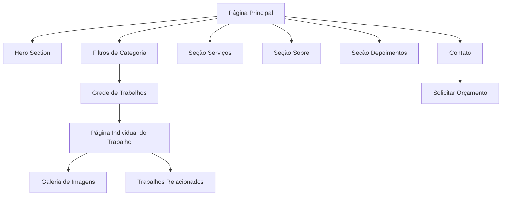

# Documento de Requisitos - Portfólio Público Moderno

## 1. Visão Geral do Produto

Criação de uma página pública de portfólio com design moderno, minimalista e organizado, inspirado no "Folio Designer Portfolio Kit" do Dribbble. O objetivo é apresentar de forma clara e atraente os trabalhos cadastrados no painel administrativo, aproveitando as informações já existentes no sistema.

* **Problema a resolver**: Necessidade de uma vitrine profissional para exibir trabalhos de design de forma organizada e atrativa

* **Público-alvo**: Clientes potenciais, visitantes interessados nos serviços de design

* **Valor de mercado**: Ferramenta de marketing e captação de novos clientes através de apresentação profissional do portfólio

## 2. Funcionalidades Principais

### 2.1 Papéis de Usuário

| Papel             | Método de Acesso      | Permissões Principais                                          |
| ----------------- | --------------------- | -------------------------------------------------------------- |
| Visitante Público | Acesso direto via URL | Visualizar portfólio, filtrar trabalhos, navegar entre páginas |
| Administrador     | Login no painel admin | Gerenciar trabalhos, categorias, conteúdo das seções           |

### 2.2 Módulos de Funcionalidade

O portfólio público consiste nas seguintes páginas principais:

1. **Página Principal**: header fixo, hero section, filtros de categoria, grade de trabalhos
2. **Página Individual do Trabalho**: detalhes completos, galeria de imagens, trabalhos relacionados
3. **Seção Serviços**: apresentação dos serviços oferecidos
4. **Seção Sobre**: informações pessoais e profissionais
5. **Seção Depoimentos**: feedback de clientes
6. **Seção Contato**: informações de contato e formulário

### 2.3 Detalhes das Páginas

| Página            | Módulo                 | Descrição da Funcionalidade                                                                                   |
| ----------------- | ---------------------- | ------------------------------------------------------------------------------------------------------------- |
| Página Principal  | Header Fixo            | Exibir logo, menu de navegação (Portfólio, Serviços, Sobre, Contato), botão de contato/WhatsApp               |
| Página Principal  | Hero Section           | Apresentar título de impacto, subtítulo, botões de ação (Ver Portfólio, Solicitar Orçamento), imagem destaque |
| Página Principal  | Sistema de Filtros     | Filtrar trabalhos por categoria, campo de busca, animações suaves                                             |
| Página Principal  | Grade de Trabalhos     | Exibir trabalhos em grid responsivo, cards com hover, paginação                                               |
| Página Individual | Cabeçalho do Trabalho  | Mostrar título, categoria, data de publicação                                                                 |
| Página Individual | Galeria de Imagens     | Exibir imagens em alta resolução, lightbox, navegação responsiva                                              |
| Página Individual | Trabalhos Relacionados | Sugerir 3 trabalhos similares da mesma categoria                                                              |
| Seção Serviços    | Lista de Serviços      | Apresentar serviços em 3 colunas com ícones e descrições                                                      |
| Seção Sobre       | Perfil Profissional    | Exibir foto, biografia, lista de clientes/áreas atendidas                                                     |
| Seção Depoimentos | Feedback de Clientes   | Mostrar depoimentos em cards com foto e nome do cliente                                                       |
| Footer            | Informações de Contato | Links de navegação, redes sociais, contatos                                                                   |

## 3. Fluxo Principal de Navegação

**Fluxo do Visitante:**

1. Acessa a página principal do portfólio
2. Visualiza hero section e trabalhos em destaque
3. Utiliza filtros para encontrar trabalhos específicos
4. Clica em um trabalho para ver detalhes
5. Navega pela galeria de imagens
6. Visualiza trabalhos relacionados
7. Acessa seções Sobre, Serviços ou Contato
8. Solicita orçamento ou entra em contato

## 4. Design da Interface do Usuário

### 4.1 Estilo de Design

* **Cores primárias**: Branco (#FFFFFF), tons muito claros (#F8F9FA)

* **Cor de destaque**: Cor institucional do sistema ou azul moderno (#3B82F6)

* **Tipografia**: Fonte limpa e moderna (Inter, Poppins ou similar)

* **Tamanhos de fonte**: H1: 48px, H2: 36px, H3: 24px, Corpo: 16px

* **Estilo de botões**: Cantos arredondados (8px), sombras suaves

* **Layout**: Espaçamento amplo, respiração entre blocos (80px-120px)

* **Animações**: Transições suaves (300ms), hover effects, fade/slide nos filtros

### 4.2 Visão Geral do Design das Páginas

| Página            | Módulo             | Elementos de UI                                                                                        |
| ----------------- | ------------------ | ------------------------------------------------------------------------------------------------------ |
| Página Principal  | Header             | Logo à esquerda, menu horizontal centralizado, botão CTA à direita, fundo branco com sombra sutil      |
| Página Principal  | Hero Section       | Layout duas colunas, título grande à esquerda, imagem/mockup à direita, botões com cores contrastantes |
| Página Principal  | Filtros            | Botões horizontais com bordas arredondadas, campo de busca minimalista, animação de fade               |
| Página Principal  | Grade de Trabalhos | Grid 3 colunas (desktop), cards com sombra suave, overlay no hover com informações                     |
| Página Individual | Galeria            | Imagens grandes com espaçamento, lightbox modal, navegação com setas                                   |
| Seções Gerais     | Serviços/Sobre     | Layout 3 colunas, ícones minimalistas, espaçamento generoso                                            |
| Footer            | Contatos           | Fundo escuro (#1F2937), texto claro, ícones de redes sociais                                           |

### 4.3 Responsividade

* **Desktop-first**: Design otimizado para telas grandes (1200px+)

* **Tablet**: Grid 2 colunas, menu colapsável

* **Mobile**: Layout empilhado, filtros em dropdown, menu hambúrguer, galeria com swipe

* **Breakpoints**: 1200px (desktop), 768px (tablet), 480px (mobile)

## 5. Integração com Dados Existentes

### 5.1 Modelos de Dados Utilizados

* **Portfolio**: título, descrição, data\_publicacao, status (ativo/inativo), link\_externo

* **PortfolioCategory**: nome da categoria para filtros

* **PortfolioImage**: imagens da galeria (thumb e imagens completas)

* **User**: informações do perfil, logo, dados de contato

### 5.2 Regras de Negócio

* Exibir apenas trabalhos com status "ativo"

* Ordenar trabalhos pela data mais recente

* Filtros puxam categorias diretamente do banco de dados

* Trabalhos relacionados baseados na mesma categoria

* Paginação com 9 trabalhos por página

### 5.3 Funcionalidades Administrativas

* Gerenciamento de trabalhos através do painel existente

* Cadastro de serviços como blocos editáveis

* Gestão de depoimentos e clientes

* Configuração de informações da seção "Sobre"

* Upload de imagens para hero section e perfil

## 6. Especificações Técnicas

### 6.1 Estrutura de Rotas

* `/portfolio` - Página principal do portfólio

* `/portfolio/{slug}` - Página individual do trabalho

* `/portfolio/categoria/{categoria}` - Filtro por categoria

* `/servicos` - Seção de serviços

* `/sobre` - Seção sobre

* `/contato` - Página de contato

### 6.2 Componentes Livewire

* `PublicPortfolioView` - Página principal com filtros

* `PortfolioWorkDetail` - Página individual do trabalho

* `PortfolioFilter` - Sistema de filtros e busca

* `ContactForm` - Formulário de contato

### 6.3 Performance e SEO

* Lazy loading para imagens

* Meta tags otimizadas para cada trabalho

* URLs amigáveis (slugs)

* Sitemap automático

* Schema markup para trabalhos

* Compressão de imagens automática

## 7. Experiência Mobile

### 7.1 Adaptações Mobile

* Menu hambúrguer colapsável

* Hero section empilhado verticalmente

* Filtros em dropdown selecionável

* Grid de trabalhos em coluna única

* Galeria com navegação por swipe

* Botões de contato fixos (WhatsApp)

### 7.2 Touch Interactions

* Swipe horizontal na galeria de imagens

* Tap para expandir cards de trabalhos

* Pull-to-refresh na listagem

* Scroll infinito opcional

## 8. Métricas e Analytics

### 8.1 Tracking de Engajamento

* Visualizações por trabalho

* Cliques em "Solicitar Orçamento"

* Tempo de permanência na página

* Filtros mais utilizados

* Trabalhos mais visualizados

### 8.2 Conversão

* Taxa de clique para contato

* Formulários preenchidos

* Downloads de materiais (se aplicável)

* Compartilhamentos em redes sociais

