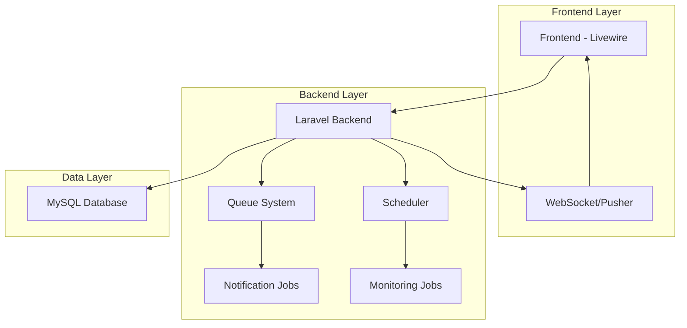
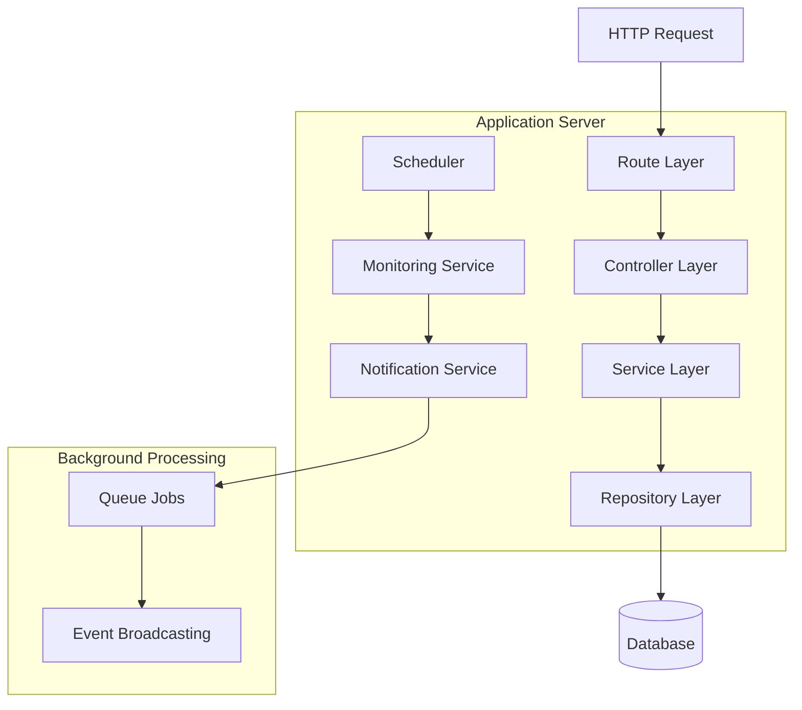
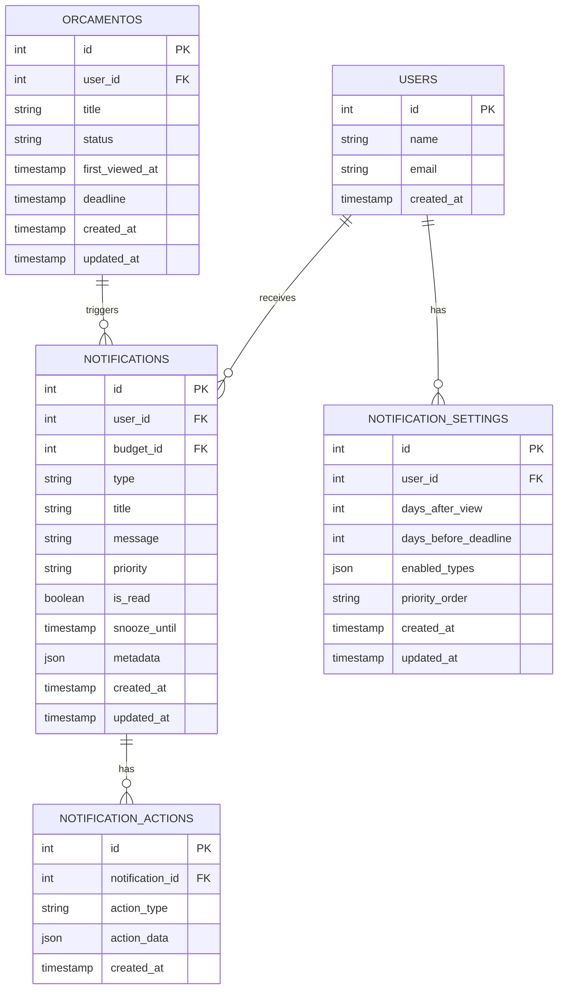

# Sistema de Notificações no Dashboard - Arquitetura Técnica

## 1. Arquitetura do Sistema



## 2. Descrição das Tecnologias

* **Frontend**: Laravel Livewire + Alpine.js + TailwindCSS

* **Backend**: Laravel 10+ com Queue System e Task Scheduler

* **Database**: MySQL (existente)

* **Real-time**: Pusher ou Laravel WebSockets

* **Cache**: Redis (opcional para performance)

## 3. Definições de Rotas

| Rota                    | Propósito                                    |
| ----------------------- | -------------------------------------------- |
| /dashboard              | Dashboard principal com card de notificações |
| /notifications          | Lista completa de notificações               |
| /notifications/settings | Configurações de notificação do usuário      |
| /notifications/history  | Histórico de notificações                    |

## 4. Definições de API

### 4.1 APIs Principais

**Buscar notificações não lidas**

```
GET /api/notifications/unread
```

Request:

| Parâmetro | Tipo    | Obrigatório | Descrição                           |
| --------- | ------- | ----------- | ----------------------------------- |
| user\_id  | integer | true        | ID do usuário autenticado           |
| limit     | integer | false       | Limite de notificações (padrão: 10) |

Response:

| Parâmetro           | Tipo    | Descrição                             |
| ------------------- | ------- | ------------------------------------- |
| notifications       | array   | Lista de notificações                 |
| unread\_count       | integer | Total de não lidas                    |
| has\_high\_priority | boolean | Se há notificações de alta prioridade |

Exemplo:

```json
{
  "notifications": [
    {
      "id": 1,
      "type": "budget_approved",
      "title": "Orçamento aprovado",
      "message": "✅ Aprovado: Livro ABC – Cliente Maria",
      "priority": "high",
      "created_at": "2025-01-15T10:30:00Z",
      "budget_id": 123,
      "client_name": "Maria Silva"
    }
  ],
  "unread_count": 5,
  "has_high_priority": true
}
```

**Marcar notificação como lida**

```
POST /api/notifications/{id}/mark-read
```

Request:

| Parâmetro | Tipo    | Obrigatório | Descrição         |
| --------- | ------- | ----------- | ----------------- |
| id        | integer | true        | ID da notificação |

Response:

| Parâmetro | Tipo    | Descrição               |
| --------- | ------- | ----------------------- |
| success   | boolean | Status da operação      |
| message   | string  | Mensagem de confirmação |

**Adiar notificação (soneca)**

```
POST /api/notifications/{id}/snooze
```

Request:

| Parâmetro | Tipo    | Obrigatório | Descrição                   |
| --------- | ------- | ----------- | --------------------------- |
| id        | integer | true        | ID da notificação           |
| duration  | string  | true        | Duração: '24h', '48h', '1w' |

Response:

| Parâmetro     | Tipo     | Descrição                    |
| ------------- | -------- | ---------------------------- |
| success       | boolean  | Status da operação           |
| snooze\_until | datetime | Data/hora quando reaparecerá |

**Atualizar configurações de notificação**

```
PUT /api/notifications/settings
```

Request:

| Parâmetro              | Tipo    | Obrigatório | Descrição                     |
| ---------------------- | ------- | ----------- | ----------------------------- |
| days\_after\_view      | integer | false       | Dias após visualização (X)    |
| days\_before\_deadline | integer | false       | Dias antes do prazo (Y)       |
| enabled\_types         | array   | false       | Tipos de notificação ativados |
| priority\_order        | string  | false       | Ordem de prioridade           |

Exemplo:

```json
{
  "days_after_view": 3,
  "days_before_deadline": 5,
  "enabled_types": ["budget_approved", "deadline_near", "viewed_no_action"],
  "priority_order": "deadlines_first"
}
```

## 5. Arquitetura do Servidor



## 6. Modelo de Dados

### 6.1 Definição do Modelo de Dados



### 6.2 Linguagem de Definição de Dados (DDL)

**Tabela de Notificações (notifications)**

```sql
-- Criar tabela
CREATE TABLE notifications (
    id BIGINT UNSIGNED PRIMARY KEY AUTO_INCREMENT,
    user_id BIGINT UNSIGNED NOT NULL,
    budget_id BIGINT UNSIGNED NULL,
    type VARCHAR(50) NOT NULL,
    title VARCHAR(255) NOT NULL,
    message TEXT NOT NULL,
    priority ENUM('low', 'medium', 'high') DEFAULT 'medium',
    is_read BOOLEAN DEFAULT FALSE,
    snooze_until TIMESTAMP NULL,
    metadata JSON NULL,
    created_at TIMESTAMP DEFAULT CURRENT_TIMESTAMP,
    updated_at TIMESTAMP DEFAULT CURRENT_TIMESTAMP ON UPDATE CURRENT_TIMESTAMP,
    
    FOREIGN KEY (user_id) REFERENCES users(id) ON DELETE CASCADE,
    FOREIGN KEY (budget_id) REFERENCES orcamentos(id) ON DELETE CASCADE
);

-- Criar índices
CREATE INDEX idx_notifications_user_id ON notifications(user_id);
CREATE INDEX idx_notifications_type ON notifications(type);
CREATE INDEX idx_notifications_priority ON notifications(priority);
CREATE INDEX idx_notifications_is_read ON notifications(is_read);
CREATE INDEX idx_notifications_created_at ON notifications(created_at DESC);
CREATE INDEX idx_notifications_snooze_until ON notifications(snooze_until);
```

**Tabela de Configurações de Notificação (notification\_settings)**

```sql
-- Criar tabela
CREATE TABLE notification_settings (
    id BIGINT UNSIGNED PRIMARY KEY AUTO_INCREMENT,
    user_id BIGINT UNSIGNED NOT NULL UNIQUE,
    days_after_view INT DEFAULT 3,
    days_before_deadline INT DEFAULT 5,
    enabled_types JSON DEFAULT '["budget_approved", "budget_rejected", "deadline_near", "viewed_no_action"]',
    priority_order ENUM('deadlines_first', 'approvals_first') DEFAULT 'deadlines_first',
    created_at TIMESTAMP DEFAULT CURRENT_TIMESTAMP,
    updated_at TIMESTAMP DEFAULT CURRENT_TIMESTAMP ON UPDATE CURRENT_TIMESTAMP,
    
    FOREIGN KEY (user_id) REFERENCES users(id) ON DELETE CASCADE
);

-- Criar índice
CREATE INDEX idx_notification_settings_user_id ON notification_settings(user_id);
```

**Tabela de Ações de Notificação (notification\_actions)**

```sql
-- Criar tabela
CREATE TABLE notification_actions (
    id BIGINT UNSIGNED PRIMARY KEY AUTO_INCREMENT,
    notification_id BIGINT UNSIGNED NOT NULL,
    action_type ENUM('mark_read', 'snooze', 'open_budget', 'send_reminder') NOT NULL,
    action_data JSON NULL,
    created_at TIMESTAMP DEFAULT CURRENT_TIMESTAMP,
    
    FOREIGN KEY (notification_id) REFERENCES notifications(id) ON DELETE CASCADE
);

-- Criar índices
CREATE INDEX idx_notification_actions_notification_id ON notification_actions(notification_id);
CREATE INDEX idx_notification_actions_type ON notification_actions(action_type);
CREATE INDEX idx_notification_actions_created_at ON notification_actions(created_at DESC);
```

**Adicionar campos à tabela orcamentos existente**

```sql
-- Adicionar campos para tracking de visualização
ALTER TABLE orcamentos 
ADD COLUMN first_viewed_at TIMESTAMP NULL AFTER status,
ADD COLUMN last_viewed_at TIMESTAMP NULL AFTER first_viewed_at,
ADD COLUMN view_count INT DEFAULT 0 AFTER last_viewed_at;

-- Criar índices
CREATE INDEX idx_orcamentos_first_viewed_at ON orcamentos(first_viewed_at);
CREATE INDEX idx_orcamentos_deadline ON orcamentos(deadline);
CREATE INDEX idx_orcamentos_status ON orcamentos(status);
```

**Dados iniciais**

```sql
-- Inserir configurações padrão para usuários existentes
INSERT INTO notification_settings (user_id, days_after_view, days_before_deadline, enabled_types, priority_order)
SELECT 
    id,
    3,
    5,
    '["budget_approved", "budget_rejected", "deadline_near", "viewed_no_action"]',
    'deadlines_first'
FROM users
WHERE id NOT IN (SELECT user_id FROM notification_settings);
```

## 7. Jobs e Schedulers

### 7.1 Jobs de Background

**MonitorBudgetDeadlines** - Executa diariamente

* Verifica orçamentos próximos do prazo (Y dias)

* Cria notificações de alta prioridade

* Evita duplicatas verificando notificações existentes

**MonitorViewedBudgets** - Executa diariamente

* Verifica orçamentos visualizados há X dias sem aprovação

* Cria notificações de média prioridade

* Implementa lógica de repetição

**CleanupNotifications** - Executa semanalmente

* Remove notificações antigas (>30 dias)

* Remove notificações de orçamentos finalizados

* Otimiza performance do sistema

### 7.2 Events e Listeners

**BudgetApproved/BudgetRejected Events**

* Dispara imediatamente quando status muda

* Cria notificação de alta prioridade

* Envia via WebSocket para tempo real

* Remove notificações pendentes do mesmo orçamento

**BudgetViewed Event**

* Registra primeira visualização

* Atualiza contadores de visualização

* Agenda verificação futura para X dias

