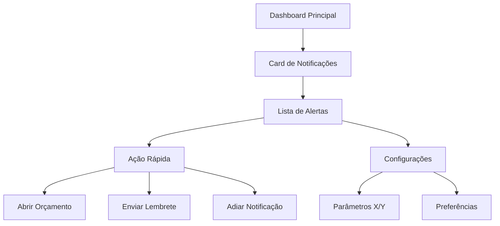

# Sistema de Notificações no Dashboard - PRD

## 1. Visão Geral do Produto

Sistema de notificações inteligente para dashboard que monitora orçamentos e dispara alertas proativos baseados em visualizações, prazos e mudanças de status. O sistema prioriza ações críticas e reduz a necessidade de acompanhamento manual, melhorando a eficiência na gestão de orçamentos.

* **Problema a resolver**: Falta de visibilidade sobre orçamentos que precisam de atenção, resultando em perda de oportunidades e prazos vencidos.

* **Usuários-alvo**: Gestores e usuários responsáveis por orçamentos que precisam de acompanhamento proativo.

* **Valor do produto**: Aumentar taxa de conversão de orçamentos e reduzir tempo de resposta através de alertas inteligentes.

## 2. Funcionalidades Principais

### 2.1 Papéis de Usuário

| Papel          | Método de Registro  | Permissões Principais                                                    |
| -------------- | ------------------- | ------------------------------------------------------------------------ |
| Usuário Padrão | Registro por email  | Pode visualizar notificações dos próprios orçamentos                     |
| Gestor         | Upgrade por convite | Pode visualizar todas as notificações e configurar parâmetros do sistema |

### 2.2 Módulos de Funcionalidade

O sistema de notificações consiste nas seguintes páginas principais:

1. **Dashboard Principal**: card de notificações, contador de não lidas, lista priorizada de alertas.
2. **Configurações de Notificação**: parâmetros X e Y, ativação/desativação por tipo, ordem de prioridade.
3. **Histórico de Notificações**: arquivo de notificações antigas, estatísticas de conversão.

### 2.3 Detalhes das Páginas

| Nome da Página      | Nome do Módulo          | Descrição da Funcionalidade                                                                        |
| ------------------- | ----------------------- | -------------------------------------------------------------------------------------------------- |
| Dashboard Principal | Card de Notificações    | Exibir contador de não lidas, lista priorizada com ícones visuais, tempo relativo e botões de ação |
| Dashboard Principal | Sistema de Alertas      | Disparar notificações em tempo real para aprovações/rejeições, consolidar alertas similares        |
| Configurações       | Parâmetros do Sistema   | Definir X dias (visualização sem aprovação) e Y dias (prazo próximo), ativar/desativar tipos       |
| Configurações       | Preferências Pessoais   | Escolher ordem de prioridade, configurar soneca, personalizar tipos de alerta                      |
| Histórico           | Arquivo de Notificações | Visualizar notificações antigas, marcar como lidas, estatísticas de efetividade                    |

## 3. Processo Principal

### Fluxo do Usuário Padrão

1. Usuário acessa dashboard e visualiza card de notificações no topo
2. Clica no card para ver lista detalhada de alertas priorizados
3. Seleciona uma notificação e escolhe ação (abrir orçamento, enviar lembrete, adiar)
4. Sistema atualiza status da notificação e remove da lista se resolvida
5. Usuário pode configurar preferências nas configurações

### Fluxo do Sistema de Alertas

1. Sistema monitora continuamente orçamentos ativos
2. Dispara alertas baseado nas regras configuradas (X dias, Y dias, aprovação/rejeição)
3. Consolida alertas similares para evitar ruído
4. Remove automaticamente alertas de orçamentos que mudaram de status
5. Envia notificações em tempo real quando possível

## 4. Design da Interface

### 4.1 Estilo de Design

* **Cores primárias**: Verde (#10B981) para aprovações, Vermelho (#EF4444) para rejeições

* **Cores secundárias**: Amarelo (#F59E0B) para prazos, Azul (#3B82F6) para visualizações

* **Estilo de botões**: Arredondados com sombra sutil, estados hover bem definidos

* **Fonte**: Inter ou similar, tamanhos 14px (corpo), 16px (títulos), 12px (metadados)

* **Layout**: Card-based no topo do dashboard, lista vertical para detalhes

* **Ícones**: Emoji ou ícones Heroicons para status (✅❌⏳👁️)

### 4.2 Visão Geral do Design das Páginas

| Nome da Página      | Nome do Módulo          | Elementos da UI                                                                                       |
| ------------------- | ----------------------- | ----------------------------------------------------------------------------------------------------- |
| Dashboard Principal | Card de Notificações    | Badge circular vermelho com contador, fundo branco/cinza claro, sombra sutil, altura 80px             |
| Dashboard Principal | Lista de Alertas        | Cards individuais com ícone à esquerda, título em negrito, cliente em cinza, tempo relativo à direita |
| Configurações       | Controles de Parâmetros | Sliders para X/Y dias, toggles para tipos de notificação, dropdown para prioridade                    |
| Configurações       | Botões de Ação          | Botões primários azuis, secundários cinza, destrutivos vermelhos                                      |
| Histórico           | Tabela de Notificações  | Zebra striping, filtros no topo, paginação no rodapé, ícones de status coloridos                      |

### 4.3 Responsividade

O sistema é mobile-first com adaptação para desktop. Em dispositivos móveis, o card de notificações ocupa largura total e a lista de alertas usa layout de stack vertical. Interações touch são otimizadas com áreas de toque de pelo menos 44px.

## 5. Regras de Negócio

### 5.1 Regras de Disparo

**Orçamento Visualizado sem Aprovação (X dias)**

* Disparar após X dias da primeira visualização sem mudança de status

* Cancelar automaticamente se orçamento for aprovado ou rejeitado

* Repetir apenas se permanecer sem ação por mais X dias

* Prioridade: Média

**Prazo Próximo (Y dias)**

* Disparar quando faltar Y dias para o prazo definido no orçamento

* Recalcular se prazo for alterado pelo usuário

* Cancelar se orçamento for finalizado ou rejeitado

* Prioridade: Alta

**Aprovação/Rejeição Imediata**

* Disparar imediatamente quando cliente aprovar ou rejeitar

* Aparecer em tempo real no dashboard (WebSocket/polling)

* Prioridade: Alta

* Formato: "✅ Aprovado: \[Título] – Cliente \[Nome]" ou "❌ Rejeitado: \[Título] – Cliente \[Nome]"

### 5.2 Regras Anti-Ruído

* Consolidar alertas similares: "3 orçamentos com prazo em 5 dias"

* Remover automaticamente alertas de orçamentos que mudaram de status

* Não criar notificações duplicadas para o mesmo evento

* Limitar máximo de 10 notificações visíveis simultaneamente

### 5.3 Ações Disponíveis

* **Marcar como lida**: Remove da lista de não lidas

* **Adiar (soneca)**: 24h, 48h, 1 semana - reaplica notificação após período

* **Abrir orçamento**: Navega diretamente para página do orçamento

* **Enviar lembrete**: Dispara email automático para cliente (se configurado)

### 5.4 Personalização

* **Parâmetros globais**: X (padrão 3 dias) e Y (padrão 5 dias) configuráveis por administrador

* **Preferências por usuário**: Ativar/desativar tipos, ordem de prioridade

* **Configurações de soneca**: Períodos personalizáveis por usuário

## 6. Mensagens do Sistema

### 6.1 Tipos de Mensagem

**Aprovação**: "✅ Aprovado: \[Título do Orçamento] – Cliente \[Nome]"
**Rejeição**: "❌ Rejeitado: \[Título do Orçamento] – Cliente \[Nome]"
**Prazo Próximo**: "⏳ Prazo em \[X] dias: Orçamento #\[ID] – Cliente \[Nome]"
**Visualizado sem Ação**: "👁️ Visualizado há \[X] dias e ainda não aprovado – Orçamento #\[ID]"
**Consolidado**: "⏳ \[Número] orçamentos com prazo em \[X] dias"

### 6.2 Tom das Mensagens

* Direto e objetivo, sem jargão técnico

* Amigável mas profissional

* Informações essenciais em formato conciso

* Uso de emojis para identificação visual rápida

* Tempo relativo em português (

